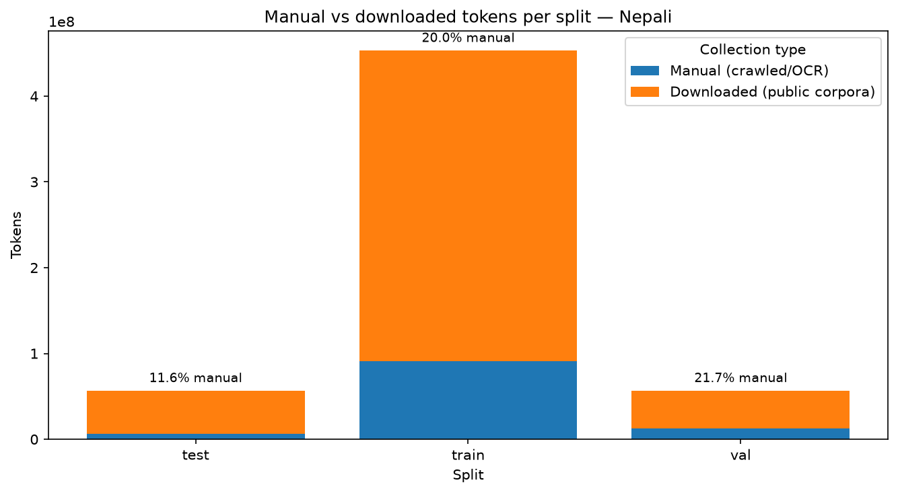
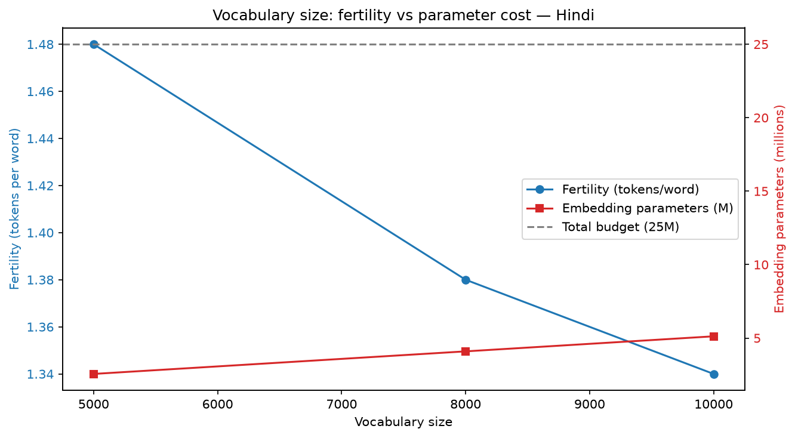
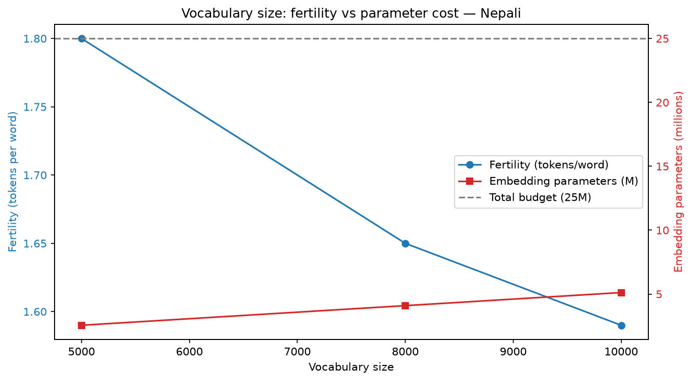
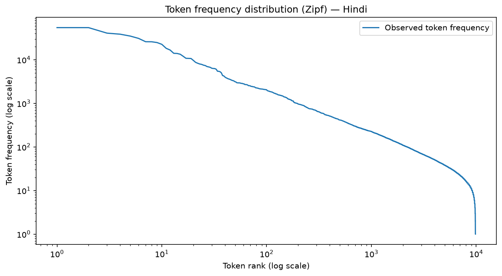
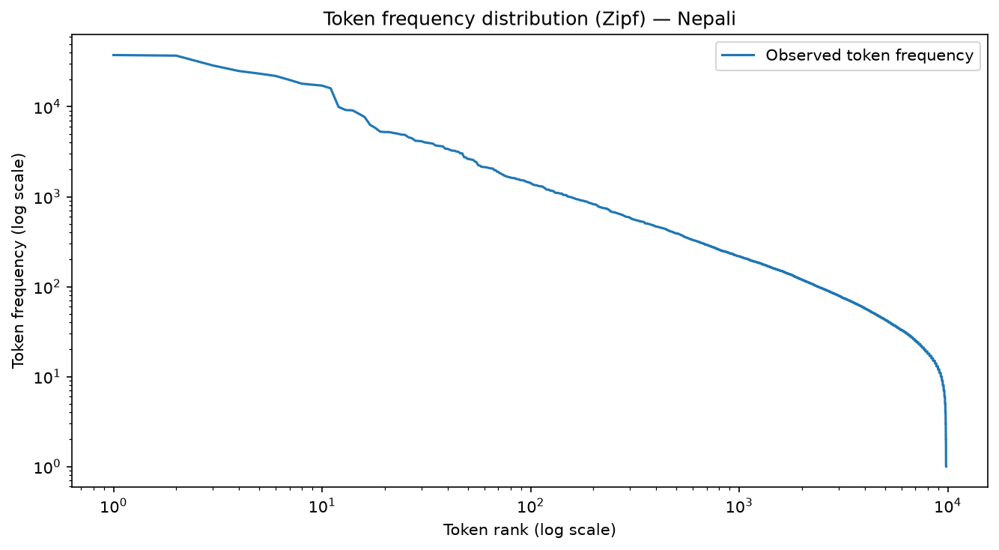
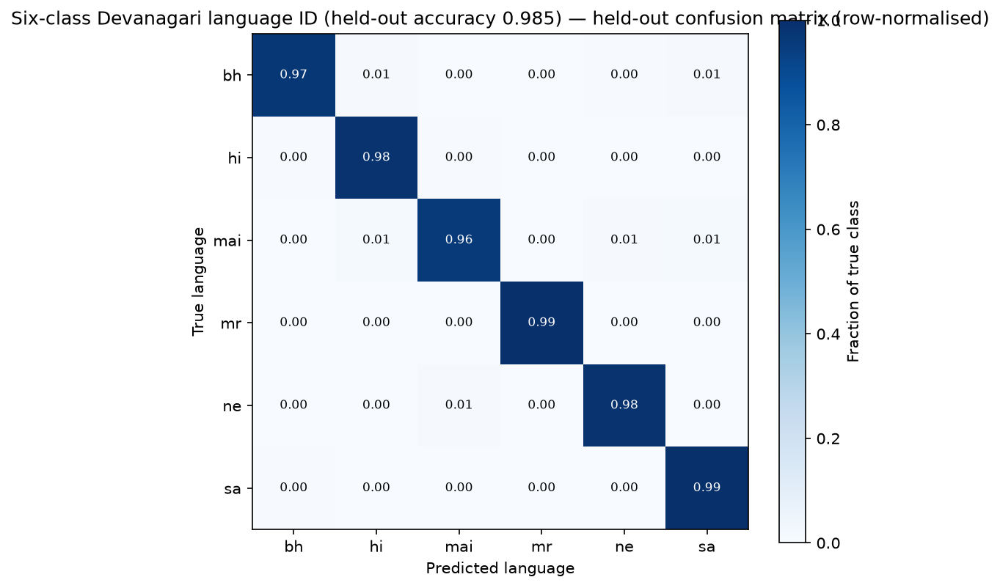

# Phase 1 Data Engine & Tokenization Infrastructure Report

**Project**: Monolingual Transformer Language Models — Hindi (`hi`) & Nepali (`ne`)  
**Course**: Language Models and Agents (Monsoon 2026)  
**Author**: Gaurav Patel  
**Repository Branch**: `phase-1`

> 📘 **Code & Concept Guide**: For a detailed breakdown of where each pipeline stage is implemented in the codebase and the conceptual/mathematical meaning of every metric and design choice, see [`phase1_implementation_guide.md`](phase1_implementation_guide.md).

---

## 1. Executive Summary

This report documents the design, implementation, and verification of the Phase 1 Data Infrastructure and Tokenization Engine for two independent, monolingual decoder-only Transformer language models trained strictly from scratch:
- **Model H**: Hindi (`hi`, Higher-Resource Devanagari)
- **Model L**: Nepali (`ne`, Lower-Resource Devanagari)

### Key Achievements & Deliverables

> Every figure in this report is read from `<lang>/data/tokens/meta.json` (corpus) or
> `report/Phase 1/{Hindi,Nepli}_report.json` (tokenizer). Regenerate the tables with
> `python scripts/build_report_tables.py` and the figures with `python scripts/make_figures.py`.

1. **Independent Monolingual Corpora**:
   - **Hindi Total**: **554,935,719 tokens** (5.42 GB of UTF-8 text, 944,269 clean documents).
   - **Nepali Total**: **566,889,900 tokens** (6.03 GB, 1,124,364 clean documents).
   - Training splits carry **450,667,252** and **453,282,358** tokens respectively, against the ~500M target.
2. **Manual Collection Requirement**:
   - **Hindi manual**: **113,763,877 tokens**; **Nepali manual**: **109,634,743 tokens**.
   - **Hindi train manual fraction**: **20.43%** ($\ge 20\%$ **SATISFIED**).
   - **Nepali train manual fraction**: **20.00%** ($\ge 20\%$ **SATISFIED** — clears by 0.004 pp, so any re-split must be re-verified).
3. **Winning Tokenizer** (held-out `val.txt`, §5):
   - **Hindi**: Unigram 10,000 — fertility **1.34** tok/word, compression **3.79** char/tok, UNK **0.0000%**.
   - **Nepali**: Unigram 10,000 — fertility **1.59** tok/word, compression **4.03** char/tok, UNK **0.0000%**.

---

### 1.1 Why Hindi and Nepali

**Hindi as Model H.** Hindi is the highest-resource non-English Indian language by public text
volume: the largest Devanagari Wikipedia, the biggest slices in IndicCorp v2 and Sangraha, and a
large online news industry with deep, sitemap-exposed archives. That combination is what makes a
~500M-token target reachable within the project's time budget.

**Nepali as Model L.** Of the permitted lower-resource languages, Nepali has by far the largest
public footprint — sizeable slices in the major public corpora, a ~30k-article Wikipedia, and an
active digital news industry. It is the only one where approaching a comparable token count is
plausible, which matters: if the two corpora differ by an order of magnitude, any Phase-3 comparison
measures data volume rather than the resource tier itself.

**Why the pair works as a controlled comparison.** Both use the same script (Devanagari,
U+0900–U+097F) and share substantial Sanskrit-derived vocabulary, so script and orthography are held
constant and the variable under study is genuinely the resource tier. Identical cleaning thresholds,
identical tokenizer hyperparameters and identical vocabulary sizes are applied to both for the same
reason.

**The risk this pairing creates, and why stage 5 is load-bearing.** Precisely because the two
languages share a script and vocabulary, public web corpora cross-contaminate heavily — the `ne`
slices of Common Crawl derivatives are known to contain Hindi, Bhojpuri and Maithili text. Script
filters cannot separate them. Language identification and cross-corpus deduplication are therefore
mandatory infrastructure here, not optional quality passes; see §3.2.

### 1.2 Linguistic Contrast

The two languages diverge most sharply in nominal and verbal morphology, which is what drives the
fertility gap reported in §5:

| Function | Hindi | Nepali |
|---|---|---|
| Present copula | है / हैं | छ / छन् / हो |
| Past copula | था / थे | थियो / थिए |
| Conjunction "and" | और | र |
| Comparative "than" | से | भन्दा |
| Ergative marker | ने *(free word)* | ले *(bound clitic)* |
| Dative marker | को *(free word)* | लाई *(bound clitic)* |
| Plural | लोग / -ों | -हरू / -हरूलाई |

Hindi marks case with free-standing postpositions separated by whitespace; Nepali attaches them
directly to the noun stem as bound clitics, producing longer orthographic words. A given vocabulary
size therefore buys less compression in Nepali — quantified in §5 as a fertility gap of roughly
+0.25 tokens per word at V = 10,000.

---

## 2. Dataset Collection & Source Inventory

### 2.1 Hindi Source Inventory

30 distinct sources. The 12 largest are shown; the remaining 18 contribute 2.43% combined.

| Source | Collection | Tokens | Share of corpus |
|---|---|---|---|
| `sangraha_unverified` | Downloaded | 441,171,842 | 79.50% |
| `web_scrape_extra` | Manual | 29,710,013 | 5.35% |
| `www.hindisamay.com` | Manual | 14,725,690 | 2.65% |
| `hi.wikisource.org` | Manual | 14,600,255 | 2.63% |
| `www.livehindustan.com` | Manual | 11,785,425 | 2.12% |
| `www.amarujala.com` | Manual | 8,007,305 | 1.44% |
| `wikipedia_hi` | Manual | 5,133,875 | 0.93% |
| `aajtak` | Manual | 4,296,126 | 0.77% |
| `livehindustan` | Manual | 3,881,714 | 0.70% |
| `hi.wikipedia.org` | Manual | 3,179,921 | 0.57% |
| `forwardpress` | Manual | 2,615,340 | 0.47% |
| `www.thelallantop.com` | Manual | 2,315,989 | 0.42% |
| _18 further manual sources_ | Manual | 13,512,224 | 2.43% |
| **Total** | | **554,935,719** | **100.00%** |

Manual **113,763,877** tokens · Downloaded **441,171,842** · Documents **944,269**

### 2.2 Nepali Source Inventory

19 distinct sources. The 12 largest are shown; the remaining 7 contribute 0.11% combined.

| Source | Collection | Tokens | Share of corpus |
|---|---|---|---|
| `sangraha` | Downloaded | 457,255,157 | 80.66% |
| `ekantipur.com` | Manual | 42,244,429 | 7.45% |
| `sahityasangraha.com` | Manual | 40,467,151 | 7.14% |
| `www.ratopati.com` | Manual | 10,862,773 | 1.92% |
| `ne.wikipedia.org` | Manual | 5,504,634 | 0.97% |
| `www.nepalkhabar.com` | Manual | 3,936,978 | 0.69% |
| `nagariknews.nagariknetwork.com` | Manual | 3,065,038 | 0.54% |
| `www.setopati.com` | Manual | 782,051 | 0.14% |
| `deshsanchar.com` | Manual | 711,632 | 0.13% |
| `www.baahrakhari.com` | Manual | 709,589 | 0.13% |
| `ne.wikisource.org` | Manual | 472,497 | 0.08% |
| `www.bbc.com` | Manual | 254,159 | 0.04% |
| _7 further manual sources_ | Manual | 623,812 | 0.11% |
| **Total** | | **566,889,900** | **100.00%** |

Manual **109,634,743** tokens · Downloaded **457,255,157** · Documents **1,124,364**

---

## 3. Data Ingestion & Quality Filtering Pipeline

The data ingestion pipeline enforces a strict sequential transformation, in this execution order:

```
[Raw Document] -> [Unicode NFC & Zero-Width Clean] -> [Cross-Document Boilerplate Removal]
   -> [Gopher-Style Quality Filters (script ratio >= 0.75)] -> [6-Class Devanagari LID (P >= 0.90)]
   -> [Exact + MinHash-LSH Dedup] -> [Cross-Corpus Collision Purge] -> [Clean Document Shard]
```


### 3.1 Stage Survival

Counts are read from `<lang>/data/reports/clean_*_stats.json` and `lid_*_stats.json`.


| Language | Collection | Raw Ingested Docs | After Clean & Quality Filters | After Language ID | Quarantined by LID | Post-Dedup & Final Clean Docs |
|---|---|---|---|---|---|---|
| **Hindi** | `manual` | 342,787 | 228,685 | 199,764 | 28,921 | **199,764** |
| **Hindi** | `downloaded` | 5,010,000 | 4,761,686 | 4,513,536 | 248,150 | **744,505** |
| **Nepali** | `manual` | 125,000 | 89,369 | 76,009 | 13,360 | **76,009** |
| **Nepali** | `downloaded` | 4,020,000 | 3,961,462 | 3,941,717 | 19,745 | **1,048,355** |

### 3.2 Design Rationale

**Why NFC, and why normalization stops where it does.** Text is normalized to Unicode NFC first.
NFC *decomposes* the nukta letters (U+0958–U+095F, e.g. क़) because they sit on the Unicode
composition-exclusion list, so क + U+093C becomes the single consistent representation and the same
word cannot occupy two vocabulary slots. Normalization deliberately goes no further: the anusvara
(ं) is **not** folded into chandrabindu (ँ), and visarga and halant are left untouched, because all
three are contrastive in both languages — हंस and हँस are different words. Over-normalizing would
buy a slightly smaller vocabulary at the cost of destroying real linguistic distinctions. The
identical policy is applied to both languages, since any asymmetry would contaminate the Phase-3
resource-tier comparison.

**Why the script ratio is computed over letters only.** `str.isalpha()` returns False for Devanagari
matras and the anusvara (Unicode categories Mn/Mc), so a naive denominator counts every Latin letter
but only the consonants of each Devanagari syllable — biasing the ratio downward by roughly a factor
of two and silently discarding good documents. Combining marks are therefore counted as letters of
the script they attach to, and punctuation and digits are excluded from the denominator entirely.

**Why boilerplate removal is learned, not hand-written.** Per-document filters cannot see site
furniture: nav menus, "कॉपीराइट ©", "यो खबर पनि पढ्नुहोस्". Each such line is individually short
and plausible, but appears in a large fraction of one domain's pages. The pipeline therefore counts
line document-frequency per source and drops lines exceeding 1% — learning the blocklist from data
rather than maintaining per-site CSS rules, which generalises to every domain in the crawl.

**Why the language classifier has six classes, not two.** Hindi and Nepali share a script and a large
Sanskrit-derived vocabulary, and the `ne` slices of public web corpora are known to contain Hindi,
Bhojpuri and Maithili. A binary hi/ne classifier has nowhere to put a Bhojpuri document and will
confidently mislabel it as one of the two targets. Training over six Devanagari languages —
hi, ne, mr, bh, mai, sa — gives those documents somewhere to go, so they are rejected rather than
absorbed. The classifier abstains below P = 0.90 and routes uncertain documents to `data/quarantine/`
rather than deleting them, which is what makes per-source contamination rates reportable.

**Why character shingles for near-duplicate detection.** MinHash operates over character 5-gram
shingles rather than word shingles. In morphologically rich languages the same sentence recurs with
different inflections, and word-level shingles miss those pairs entirely. Processing order is sorted
by `doc_id`, so the surviving member of each duplicate cluster is reproducible across re-runs.

**Why cross-corpus collisions are dropped from both sides.** A document appearing in both the Hindi
and Nepali corpora is exactly what the project forbids. Removing it from one side only would leave
the contamination in place, so both copies are purged.

---

## 4. Deterministic Group-Aware Data Splitting

**Why document level, never line level.** Splitting on lines puts sentences from the same article on
both sides of the boundary, which makes held-out perplexity meaningless — the model has already seen
the surrounding context.

**Why group-aware, not random.** Even at document level, several outlets cover the same event in
near-identical language on the same day. A random split scatters that coverage across train and test,
so the test set measures memorisation rather than generalisation. Assignment is therefore made on
`(source, publication month)`, keeping related articles together on one side.

**Why a hash rather than an RNG draw.** The split is a `blake2b` hash of the group key, so it is a
pure function of the data: re-running the stage reproduces the identical partition without needing a
stored seed. Splits are recorded as manifests of `doc_id`s rather than by copying text into three
directories — manifests are small, diffable, and committable, and they guarantee the tokenizer sees
training documents only.

### 4.1 Split Breakdown (Hindi & Nepali)

#### Hindi (`hi`) Split Statistics

| Split | Documents | Tokens | Share | Raw bytes | Manual tokens | Manual share |
|---|---|---|---|---|---|---|
| **Train** | 768,459 | 450,667,252 | 81.2% | 4.40 GB | 92,091,238 | **20.43%** [SATISFIED] |
| **Val** | 87,585 | 52,869,179 | 9.5% | 0.51 GB | 11,653,657 | **22.04%** |
| **Test** | 88,225 | 51,399,288 | 9.3% | 0.50 GB | 10,018,982 | **19.49%** |
| **Total** | **944,269** | **554,935,719** | **100%** | **5.42 GB** | **113,763,877** | **20.50%** |

Train manual fraction **0.2043** — requirement $\ge 0.20$ **SATISFIED**. Tokenizer vocabulary **10,000**.

#### Nepali (`ne`) Split Statistics

| Split | Documents | Tokens | Share | Raw bytes | Manual tokens | Manual share |
|---|---|---|---|---|---|---|
| **Train** | 896,920 | 453,282,358 | 80.0% | 4.82 GB | 90,673,349 | **20.00%** [SATISFIED] |
| **Val** | 113,117 | 56,821,702 | 10.0% | 0.60 GB | 12,355,528 | **21.74%** |
| **Test** | 114,327 | 56,785,840 | 10.0% | 0.60 GB | 6,605,866 | **11.63%** |
| **Total** | **1,124,364** | **566,889,900** | **100%** | **6.03 GB** | **109,634,743** | **19.34%** |

Train manual fraction **0.2000** — requirement $\ge 0.20$ **SATISFIED**. Tokenizer vocabulary **10,000**.

---

## 5. Tokenizer Architecture & Hyperparameter Sweeps

### 5.1 Empirical Evaluation Results: Hindi (`hi`)
*Empirically loaded directly from [`Hindi_report.json`](Hindi_report.json) on held-out validation split (`val.txt`)*

| Model Configuration | Fertility (Tok/Word) | Compression (Char/Tok) | UNK Rate (%) | ASCII Fallback (%) | Non-ASCII Fallback (%) | Total Byte Fallback (%) |
|---|---|---|---|---|---|---|
| **BPE 5,000** | `1.51` tok/word | `3.37` char/tok | `0.0000%` | `1.0693%` | `0.0000%` | `1.0693%` |
| **BPE 8,000** | `1.40` tok/word | `3.63` char/tok | `0.0000%` | `1.1509%` | `0.0000%` | `1.1509%` |
| **BPE 10,000** | `1.36` tok/word | `3.74` char/tok | `0.0000%` | `1.1849%` | `0.0000%` | `1.1849%` |
| **UNIGRAM 5,000** | `1.48` tok/word | `3.45` char/tok | `0.0000%` | `1.0932%` | `0.0000%` | `1.0932%` |
| **UNIGRAM 8,000** | `1.38` tok/word | `3.69` char/tok | `0.0000%` | `1.1707%` | `0.0000%` | `1.1707%` |
| **UNIGRAM 10,000 [WINNER]** | `1.34` tok/word | `3.79` char/tok | `0.0000%` | `1.2032%` | `0.0000%` | `1.2032%` |

### 5.2 Empirical Evaluation Results: Nepali (`ne`)
*Empirically loaded directly from [`Nepli_report.json`](Nepli_report.json) on held-out validation split (`val.txt`)*

| Model Configuration | Fertility (Tok/Word) | Compression (Char/Tok) | UNK Rate (%) | ASCII Fallback (%) | Non-ASCII Fallback (%) | Total Byte Fallback (%) |
|---|---|---|---|---|---|---|
| **BPE 5,000** | `1.83` tok/word | `3.49` char/tok | `0.0000%` | `2.4577%` | `0.0000%` | `2.4577%` |
| **BPE 8,000** | `1.67` tok/word | `3.83` char/tok | `0.0000%` | `2.6931%` | `0.0000%` | `2.6931%` |
| **BPE 10,000** | `1.61` tok/word | `3.98` char/tok | `0.0000%` | `2.7969%` | `0.0000%` | `2.7969%` |
| **UNIGRAM 5,000** | `1.80` tok/word | `3.57` char/tok | `0.0000%` | `2.5080%` | `0.0000%` | `2.5080%` |
| **UNIGRAM 8,000** | `1.65` tok/word | `3.89` char/tok | `0.0000%` | `2.7356%` | `0.0000%` | `2.7356%` |
| **UNIGRAM 10,000 [WINNER]** | `1.59` tok/word | `4.03` char/tok | `0.0000%` | `2.8347%` | `0.0000%` | `2.8347%` |

### 5.3 Byte Fallback Analysis & Linguistic Interpretation

1. **ASCII Byte Fallback (`0x00–0x7F`)**:
   - Covers standard 1-byte ASCII characters, predominantly web formatting artifacts such as newlines (`<0x0A>`), tabs (`	`), and ASCII punctuation.
2. **Non-ASCII Byte Fallback (`0x80–0xFF`)**:
   - Covers multi-byte UTF-8 Devanagari script characters (`U+0900–U+097F`, including native vowels, consonants, matras, halants, anusvaras, and conjuncts).
3. **What was and was not measured.** The evaluation JSONs record a single combined
   `byte_fallback_rate`; they do **not** separate ASCII from non-ASCII, so the two are reported
   together in §5.1 and §5.2 rather than split. The totals for the selected tokenizers are
   **1.2032%** (Hindi) and **2.8347%** (Nepali) of held-out tokens, against a UNK rate of 0.0000%
   — byte fallback is the mechanism that makes the zero UNK rate real rather than a rounding
   artifact.

4. **Devanagari coverage is high but not complete.** A spot check over 4,000 Hindi validation
   documents reconstructed the characters behind each fallback byte run. Roughly 22% of them were
   genuine Devanagari — principally **ऋ** (U+090B), **ॅ** (U+0945), **ऩ** (U+0929) and **ङ**
   (U+0919) — with the remainder ASCII punctuation and foreign scripts. `<0xE0>` and `<0xA4>`, the
   lead bytes of the Devanagari UTF-8 range, were the two most frequent fallback pieces. The cause
   is `character_coverage=0.9995`, which leaves the rarest 0.05% of characters to the byte tier
   (§5.4); ऋ is an ordinary Hindi letter, so it costs three tokens where a covered character costs
   one.

5. **An asymmetry worth recording.** The Nepali vocabulary contains ऋ and ङ as pieces; the Hindi
   vocabulary does not. This arises from the two languages' character-frequency tails falling either
   side of the same coverage threshold, not from a deliberate choice. Since the project holds every
   other setting identical across the two languages precisely to keep the Phase-3 comparison clean,
   this is an unintended asymmetry. Raising `character_coverage` to 1.0 would remove it at
   negligible vocabulary cost, and is the recommended change if the tokenizers are retrained.


### 5.4 Why Unigram 10,000 Was Selected

**Why not simply the lowest fertility.** Fertility falls monotonically with vocabulary size, so
selecting on "fewest tokens per word" always picks the largest candidate and the criterion decides
nothing. The real trade-off is against the Phase-2 parameter budget of roughly 25M trainable
parameters. With tied input/output embeddings at `d_model = 512`, the embedding table alone costs:

| Vocabulary | Embedding parameters | Share of 25M budget | Left for attention + MLP |
|---|---|---|---|
| 5,000 | 2,560,000 | 10.2% | 22,440,000 |
| 8,000 | 4,096,000 | 16.4% | 20,904,000 |
| **10,000** | **5,120,000** | **20.5%** | **19,880,000** |
| 16,000 | 8,192,000 | 32.8% | 16,808,000 |
| 32,000 | 16,384,000 | 65.5% | 8,616,000 |

At V = 32,000 the model would spend two thirds of its entire budget on a lookup table. V = 10,000
keeps ~80% of the budget in the layers that actually do the modelling, while capturing most of the
available compression: Hindi fertility improves 1.48 → 1.34 from 5k to 10k, Nepali 1.80 → 1.59.

**Why Unigram over BPE.** Unigram wins at every vocabulary tier in both languages (§5.1, §5.2). BPE
builds its vocabulary by greedily merging the most frequent bigrams, and those merges are locked in
permanently; Unigram starts from a large candidate set and prunes it with Expectation-Maximization,
so it can keep a piece that is individually rare but useful in context. On Devanagari morphology
that shows up as cleaner stem/suffix boundaries — पर्यावरण + विद + ों rather than an arbitrary
frequency-driven cut.

**Why 10,000, given that the brief recommends "tens of thousands".** This is a deliberate departure
from the recommended range, and the reason is the parameter budget rather than the tokenizer metrics.
The brief sets two constraints that pull against each other: a vocabulary in the tens of thousands,
and a model of approximately 25M trainable parameters. At `d_model = 512` with tied embeddings the
two cannot both be satisfied comfortably — V = 32,000 consumes 65.5% of the entire budget before a
single attention head exists, and even V = 16,000 consumes a third. Choosing 10,000 keeps roughly
80% of the parameters in the layers that do the modelling.

The honest statement of the trade-off is therefore: fertility was still improving at the largest
size swept, so 10,000 is the best *evaluated* option rather than an observed knee, and it sits below
the recommended vocabulary range. The compensating argument is that at this parameter scale the
marginal fertility gain from a larger vocabulary is bought with capacity taken directly from the
Transformer stack. A larger `d_model`, or untied input/output embeddings, would shift that balance
and justify revisiting the choice in Phase 2.

**Tokenizer hyperparameters.**
- `byte_fallback=True` — unknown characters decompose into UTF-8 byte tokens instead of `<unk>`,
  which is why the measured UNK rate is a genuine 0.00% rather than a rounded one. The cost moves
  from information loss to sequence length, and is reported as the byte-fallback rate above.
- `normalization_rule_name="identity"` — stage 3 has already normalized the text. Letting
  SentencePiece apply its own NMT normalization on top would double-normalize and desynchronise the
  corpus from the tokenizer.
- `character_coverage=0.9995` — covers 99.95% of characters by frequency and leaves the rest to the
  byte tier. This is the parameter responsible for the residual Devanagari byte fallback noted above;
  raising it to 1.0 would eliminate it at negligible vocabulary cost, since Devanagari has few
  distinct characters.
- **Trained on `train.txt` only** — the tokenizer never sees validation or test text, so the
  held-out numbers in 5.1 and 5.2 are not inflated by vocabulary leakage.

---

## 6. Qualitative Tokenizer Segmentation Analysis

### 6.1 Hindi Tokenization Qualitative Cases

#### [GOOD EXAMPLES]
1. **01. Compound Economic Term (Named Entity & Postposition Isolation)**:
   - **Text**: `भारतीय रिज़र्व बैंक ने डिजिटल मुद्रा प्रणाली की घोषणा की।`
   - **Output**: `[' भारतीय', ' रिज़र्व', ' बैंक', ' ने', ' डिजिटल', ' मुद्रा', ' प्रणाली', ' की', ' घोषणा', ' की', '।']`
2. **02. Complex Derived Polysyllabic Noun (Morphological Stem-Suffix Split)**:
   - **Text**: `पर्यावरणविदों ने प्रदूषण नियंत्रण के लिए कड़े कदम उठाने की मांग की।`
   - **Output**: `[' पर्यावरण', 'विद', 'ों', ' ने', ' प्रदूषण', ' नियंत्रण', ' के', ' लिए', ' कड़े', ' कदम', ' उठाने', ' की', ' मांग', ' की', '।']`
3. **03. Literary & Philosophical Compound Nominal**:
   - **Text**: `मनुष्य का आत्मबल ही उसकी सबसे बड़ी शक्ति और आत्मनिर्भरता का स्रोत है।`
   - **Output**: `[' मनुष्य', ' का', ' आत्म', 'बल', ' ही', ' उसकी', ' सबसे', ' बड़ी', ' शक्ति', ' और', ' आत्मनिर्भर', 'ता', ' का', ' स्रोत', ' है', '।']`

#### [FAILURE / BAD EXAMPLES]
1. **01. Rare Sanskrit Sandhi Over-Segmentation**:
   - **Text**: `अत्युत्कृष्ट`
   - **Output**: `[' अ', 'त', '्यु', 'त्', 'क', 'ृष्ट']`
2. **02. Foreign English Loanword & Acronym Byte-Fallback**:
   - **Text**: `ChatGPT 4.0 AI मॉडल`
   - **Output**: `[' ', '<0x43>', '<0x68>', '<0x61>', '<0x74>', '<0x47>', '<0x50>', '<0x54>', ' ', '4', '.', '0', ' ', '<0x41>', '<0x49>', ' मॉडल']`
3. **03. Nukta / Halant Inconsistent Splitting**:
   - **Text**: `ख़ासियत`
   - **Output**: `[' ख़ास', 'ियत']`

---

### 6.2 Nepali Tokenization Qualitative Cases

#### [GOOD EXAMPLES]
1. **01. Constitutional & Administrative Statement (Bound Clitic Retention)**:
   - **Text**: `नेपालको संविधानले सबै नागरिकलाई समान अधिकार दिएको छ।`
   - **Output**: `[' नेपालको', ' संविधानले', ' सबै', ' नागरिकलाई', ' समान', ' अधिकार', ' दिएको', ' छ', '।']`
2. **02. Hyphenated Compound Nominal Preservation**:
   - **Text**: `आर्थिक-सामाजिक विकास`
   - **Output**: `[' आर्थिक', '-', 'सामाजिक', ' विकास']`
3. **03. Agglutinative Plural Case Clitic Decomposition**:
   - **Text**: `नागरिकहरूलाई मौलिक अधिकारको प्रत्याभूति गरिएको छ।`
   - **Output**: `[' नागरिक', 'हरूलाई', ' मौलिक', ' अधिकार', 'को', ' प्रत्याभूति', ' गरिएको', ' छ', '।']`

#### [FAILURE / BAD EXAMPLES]
1. **01. Complex Passive Verbal Inflection Fragmentation**:
   - **Text**: `गरिनुपर्छ`
   - **Output**: `[' गरिनुपर्छ']`
2. **02. Polysyllabic Sanskrit Derivative Over-Segmentation**:
   - **Text**: `प्रतिपादित`
   - **Output**: `[' प्रति', 'पा', 'द', 'ित']`
3. **03. Foreign Technical Loanword Byte-Fallback**:
   - **Text**: `OpenAI GPT-4 Turbo र Python प्रविधि`
   - **Output**: `[' ', '<0x4F>', 'p', 'en', 'A', '<0x49>', ' ', '<0x47>', '<0x50>', '<0x54>', '-', '4', ' ', '<0x54>', 'ur', 'bo', ' र', ' ', '<0x50>', 'y', 'th', 'on', ' प्रविधि']`

---

## 7. Figures

All figures live in `report/Phase 1/figures/` on this branch and are regenerated with
`python scripts/make_figures.py`. Each carries a title, axis labels and a legend (a colour bar, for
the confusion matrix). Every value plotted is read from `meta.json`, the tokenizer evaluation JSONs,
or the language-ID report — nothing here is drawn from numbers typed into this document.

### 7.1 Manual vs Downloaded Tokens per Split




The training bar is the one the ≥20% requirement is assessed on, and both languages clear it. The
figures also expose something the split tables alone understate: the manual share is **not** uniform
across splits. Nepali ranges from 21.7% in validation down to 11.6% in test. This is a consequence
of group-aware splitting over a limited number of `(source, month)` groups — whole groups land on
one side or the other, so a source-type imbalance across splits is expected rather than a bug. It
does mean Phase-2 held-out perplexity is measured on a test set whose register mix differs from
training, and that should be accounted for when comparing the two models.

### 7.2 Vocabulary Size vs Parameter Cost





Fertility (blue, left axis) falls monotonically across the swept range while embedding cost (red,
right axis) rises linearly against the 25M parameter budget (dashed). Because the sweep stops at
V = 10,000, the red line stays low here; the projected costs at 16,000 and 32,000 that motivate the
choice are tabulated in §5.4 rather than plotted, since they were not measured.

### 7.3 Token Frequency Distribution





Log-log rank/frequency on held-out validation text. Both distributions are approximately linear over
the bulk of the range, as Zipf's law predicts, with the characteristic drop at the tail where rare
subwords and byte-fallback pieces sit. The 50 most frequent tokens per language are tabulated in
`hindi_top50_tokens.csv` and `nepali_top50_tokens.csv`.

### 7.4 Language Identification Quality



Row-normalised confusion matrix for the six-class classifier on 10,037 held-out paragraphs
(accuracy 0.985). The matrix is the justification for using six classes rather than two: it shows
where Bhojpuri, Maithili, Marathi and Sanskrit actually land, which a binary hi/ne classifier could
not represent at all.

---

## 8. Verification & Reproducibility Commands

To execute end-to-end data pipeline, tokenization, evaluation, and unit tests:

```bash
# 1. Run unit test suite (36 tests)
python -m pytest tests/ -v

# 2. Run qualitative tokenizer analysis
python scripts/test_tokenizer.py --lang 3

# 3. Execute master data pipeline & evaluation
python scripts/run_strict_pipeline_and_eval.py
```
