# Phase 2: Model Implementation, Pretraining and Evaluation

**Project**: Monolingual Transformer Language Models for Hindi (`hi`) and Nepali (`ne`)
**Course**: Language Models and Agents (Monsoon 2026)
**Author**: Gaurav Patel
**Branch**: `phase-2`

> 📘 **Code & Concept Guide**: For a comprehensive, step-by-step breakdown of where each model component is implemented in the codebase and the conceptual/mathematical meaning of every metric, tensor operation, and design choice, see [`phase2_implementation_guide.md`](phase2_implementation_guide.md).

> Every number in this report is read from a measured artifact: `report/Phase 2/evaluation_test.json`,
> `attention_analysis.json`, or the training logs in `logs/`. Regenerate them with the commands in Section 11.

---

## 1. Executive Summary

Two decoder-only Transformer language models were implemented from PyTorch primitives and pretrained
independently, one per language. Neither shares data, tokenizer, vocabulary or weights with the other.

| | Model H (Hindi) | Model L (Nepali) |
|---|---|---|
| Parameters | **25,350,912** | **25,350,912** |
| Training tokens | 450,667,252 (1 epoch) | 453,282,358 (1 epoch) |
| Training time | 5.73 h | 5.74 h |
| Hardware | Kaggle Tesla P100 | Kaggle Tesla P100 |
| **Test perplexity** | **24.39** | 29.87 |
| **Test bits-per-byte** | 0.4709 | **0.4600** |
| Test tokens scored | 51,399,168 | 56,785,408 |

The two intrinsic metrics disagree. Perplexity says Hindi is the better model, bits-per-byte says
Nepali is. Since perplexity is measured per token and the two models have different tokenizers, only
bits-per-byte is comparable, so the apparent Hindi advantage is mostly an artifact of its tokenizer.
Section 4.3 works through this, and Section 8 tests it again on six models where the corpus is held
identical and only the tokenizer changes.

Nine models were trained in total: Model H and Model L, four for the vocabulary sweep (Section 8),
the no-positional ablation (Section 9), and a two-epoch continuation of Model H.


---

## 2. What Was Built, and Why

The model is a GPT-style decoder-only Transformer. Only `nn.Linear`, `nn.Embedding`, `nn.LayerNorm`
and `nn.Dropout` are used; no `nn.Transformer*` module, no HuggingFace class, and no pre-built
attention. Implementation: [`lmagpt/model.py`](../../lmagpt/model.py).

### 2.1 The forward pass, step by step

A batch of token ids enters as `(B, T)` and leaves as `(B, T, vocab)` next-token logits.

```
idx (B, T)  int64 token ids
  │
  ├─ token embedding      (vocab 10,000 x d_model 512)  →  (B, T, 512)
  ├─ embedding dropout
  │
  ├─ 7 x Transformer block:
  │     x = x + Attention(LayerNorm(x))     ← mixes information ACROSS positions
  │     x = x + FeedForward(LayerNorm(x))   ← processes EACH position independently
  │
  ├─ final LayerNorm                        →  (B, T, 512)
  └─ output projection (tied to embedding)  →  (B, T, 10,000)
```

### 2.2 Multi-head causal self-attention, from first principles

Written out explicitly rather than through a fused kernel:

```python
q = q_proj(x).view(B, T, n_head, head_dim).transpose(1, 2)   # (B, 8, T, 64)
k = k_proj(x).view(B, T, n_head, head_dim).transpose(1, 2)
v = v_proj(x).view(B, T, n_head, head_dim).transpose(1, 2)

q, k = apply_rope(q, cos, sin), apply_rope(k, cos, sin)       # position enters here

scores  = (q @ k.transpose(-2, -1)) / sqrt(head_dim)          # (B, 8, T, T)
scores  = scores.masked_fill(causal_mask, -inf)               # future → zero probability
weights = softmax(scores, dim=-1)
out     = out_proj((weights @ v).transpose(1, 2).reshape(B, T, 512))
```

Why the reshape. `d_model = 512` splits into 8 heads of 64 dimensions. The transpose puts the head
axis before time so each head's `(T, 64)` slice is contiguous for the matmuls; each head learns a
different relationship over the same tokens, and `out_proj` recombines those views.

**Why divide by √d_k.** `q·k` sums `head_dim = 64` products, so its variance grows linearly with
`head_dim`. Unscaled, logits would be ~8× larger, softmax would saturate toward one-hot, and the
gradient through it would vanish. Dividing by `√64 = 8` holds variance near 1.

Why `-inf` before softmax. `exp(-inf) = 0`, so masked positions get exactly zero probability after
normalisation. Masking *after* softmax would leave the remaining weights not summing to one.

Why `F.scaled_dot_product_attention` was avoided. It is arguably a pre-built attention primitive,
which the brief forbids, and its fused kernels never materialise the `(B, h, T, T)` weight matrix,
which is exactly what Section 6 measures.

### 2.3 Positional information: RoPE

Self-attention is permutation-invariant. Without positional information, "राम ने श्याम को देखा" and
"श्याम ने राम को देखा" produce identical representations. Rotary Position Embedding (RoPE) injects
position by **rotating** the query and key vectors by an angle proportional to their position.

Each adjacent pair of dimensions is treated as a 2-D vector and turned:

```
x_even' = x_even·cos(mθ) − x_odd ·sin(mθ)
x_odd'  = x_odd ·cos(mθ) + x_even·sin(mθ)
```

**Why RoPE rather than a learned table.**

1. **Zero parameters.** A learned table needs `512 × 512 = 262,144` weights; those savings plus a
   narrower FFN are what fund a *seventh* layer inside the ~25M budget.
2. **Relative by construction.** Rotations compose, so the dot product between a query rotated by `m`
   and a key rotated by `n` depends only on the distance between them. The model never has to learn separately that
   positions 300 and 301 are adjacent. Verified in
   `tests/test_model.py::test_rope_is_relative_not_absolute`.
3. **Applied to Q and K only, never V.** Position should bias *where* attention looks, not *what* is
   retrieved once it looks there.

Sequence length. A learned table imposes a hard ceiling: position 512 would be an `IndexError`.
RoPE's only limit is the precomputed cos/sin cache, extendable at any time, with graceful degradation
beyond the trained length since those rotation angles were never seen. Our cache holds 512 positions,
matching the context. `head_dim` must be even for RoPE to split into pairs; ours is 64, and the config
raises a `ValueError` if that ever breaks.

### 2.4 Feed-forward network

Each position expands to `d_ff = 1792`, passes through GELU, and projects back to 512. Attention
decides *what to look at*; the FFN decides *what to do with it*, per position.

**Why 3.5× `d_model` rather than the conventional 4×.** Both FFN matrices are `d_model × d_ff`, making
the FFN roughly two thirds of each block's parameters. At 4x (2048) seven layers cost 27.19M, which is 8.8%
over target; 3.5× gives **25,350,912**, +1.4%, keeping all seven layers. **Depth was bought with FFN
width**: a seventh round of attention composes relationships across more stages, which we judged more
valuable at this scale than a wider per-position transform.

### 2.5 Pre-norm, not post-norm

LayerNorm is applied to each sublayer's *input*, leaving the residual stream an unnormalised identity
path from embeddings to the final norm.

Why it is more stable at depth. In post-norm, a gradient travelling from the loss back to layer 0
passes through seven LayerNorm Jacobians, each able to attenuate it. Pre-norm's residual path is clean
addition, so gradients reach early layers undiminished, which is why pre-norm trains at depth without
a long warmup. Visible in our run: gradient norms stayed flat at 0.65–0.70 for all 27,500 steps and
never hit the clipping threshold.

### 2.6 Tied embeddings

The output projection reuses the input embedding matrix, saving `10,000 x 512 = 5,120,000` parameters (a fifth of the budget) and tying a token's "input meaning" and "output meaning" to one vector.

One consequence, found while testing. The residual stream carries each token's own embedding
forward and the output projection is that same matrix, so the logit for the *current* token is
elevated before any training: an untrained model scores **3.59** against `ln(V) = 4.16` when asked to
predict the token it can already see. A dataloader that forgets to shift targets therefore produces a
beautiful descending loss curve and a model that learned nothing. Pinned by
`tests/test_model.py::test_predicting_the_current_token_is_trivially_easy`.

### 2.7 Final configuration

Identical for both languages, except the language identifier, any asymmetry would confound the
Phase 3 comparison, the same argument used for the Phase 1 cleaning thresholds.

| Setting | Value | Reason |
|---|---|---|
| `d_model` | 512 | matches the Phase-1 vocabulary sizing assumption |
| `n_layer` | 7 | depth preferred over FFN width at fixed budget |
| `n_head` | 8 | `head_dim` = 64, even, RoPE-compatible |
| `d_ff` | 1792 | 3.5×, keeps 7 layers inside ~25M |
| `context` | 512 | ≈ one document (mean 586 tok Hindi / 505 Nepali) |
| `dropout` | 0.1 |, see Section 7.2, this turned out to be the wrong call |
| positional | RoPE | zero params, relative, no hard length ceiling |
| norm | pre-norm | stable gradient path at depth |
| embeddings | tied | saves 5.12M params |

**Parameter breakdown**, verified by test:

```
token embedding (tied)  5,120,000   20.2%
7 transformer blocks   20,230,912   79.8%
                       ──────────
TOTAL                  25,350,912
```

### 2.8 Verifying the causal mask empirically

The brief requires demonstrating that the model cannot see the future. Three tests do this:

1. **The direct test.** Two sequences identical up to position *t* and different after it produce
   **bit-identical** logits at every position ≤ *t*. The test also asserts the changed region *did*
   change, so it cannot pass vacuously.
2. **Post-softmax mass above the diagonal is exactly `0.0`**, and every row sums to 1.
3. **Position 0 places all its mass on itself**, with nothing to look back on, that is the only
   possibility.

All 63 unit tests pass, covering both phases.


---

## 3. How the Models Were Trained

Implementation: [`lmagpt/train.py`](../../lmagpt/train.py).

### 3.1 Setup

| | |
|---|---|
| Objective | Causal LM, cross-entropy between logits at *t* and the token at *t+1* |
| Optimiser | AdamW, β = (0.9, 0.95), weight decay 0.1 |
| Schedule | 500-step linear warmup → cosine decay 6.0e-4 → 6.0e-5 |
| Batch | micro 16 × accum 2 × 512 = **16,384 tokens/step** |
| Steps | 27,500 = 450M tokens = **1 epoch** |
| Precision | bf16 autocast |
| Gradient clipping | 1.0 |

**Why β₂ = 0.95 rather than the 0.999 default.** Language-model gradients are noisy; a shorter
second-moment memory adapts faster to changing curvature. This is standard for GPT-style training.

**Why weight decay applies to matrices only.** Decaying LayerNorm gains and biases pulls them toward
zero, working against the normalisation itself. Parameters of rank ≥ 2 are decayed; the rest are not.

**Why warmup.** Adam's second-moment estimate is unreliable in the first few hundred steps. Stepping
at full learning rate before it settles is the classic way to destabilise a fresh Transformer.

**Why gradient accumulation.** Micro-batch 16 × accumulation 2 gives the same effective batch as a
plain batch of 32, but fits in 4.2 GB rather than 7.8 GB. That means the identical optimisation runs
on a 6 GB laptop GPU and a 16 GB Kaggle P100, only the micro-batch changes, never the maths.

**Checkpoint-resume and the Kaggle environment.** Each checkpoint carries weights, optimizer state,
step counter, RNG streams and config, written to a temp file and renamed so an interrupted save
leaves the previous good file intact; training stops on a wall-clock budget before Kaggle's 12-hour
kill, and `kernel_sources` mounts run *N*'s output as run *N+1*'s input. One environment detail
matters for reproduction: Kaggle allocates a **Pascal P100 (sm_60)**, and its preinstalled torch ships
kernels only for sm_70+, so the first CUDA op dies with `cudaErrorNoKernelImageForDevice`.
[`lmagpt/kaggle_bootstrap.py`](../../lmagpt/kaggle_bootstrap.py) detects this via `nvidia-smi`, deliberately *before* importing torch, and installs torch 2.5.1+cu121.

### 3.2 Training behaviour

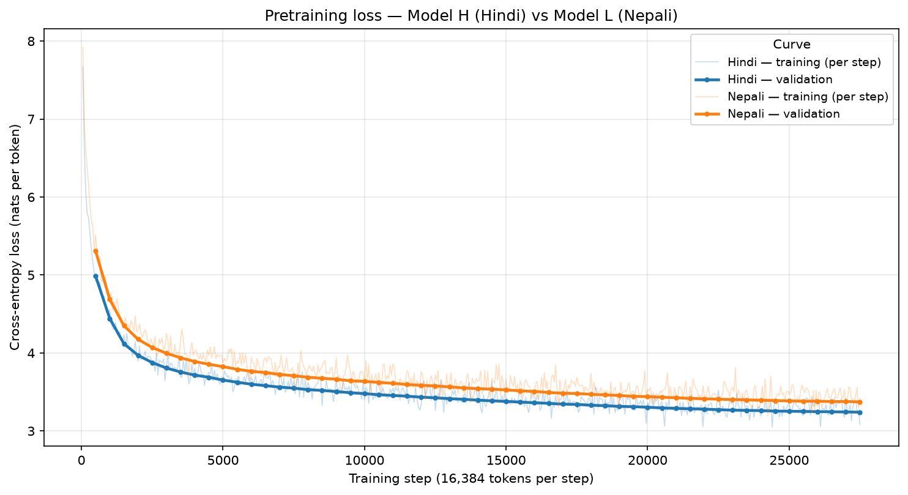

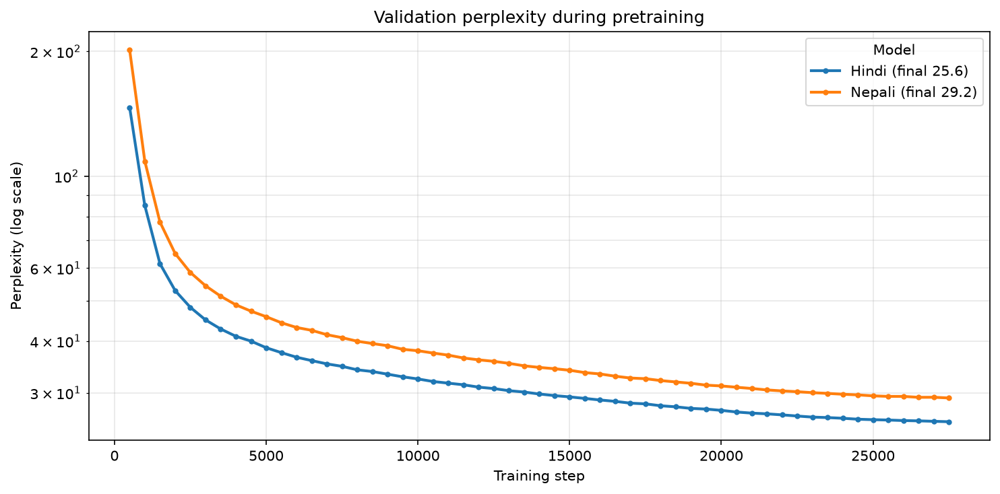

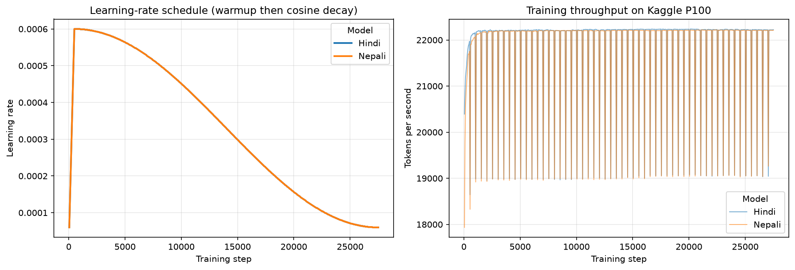

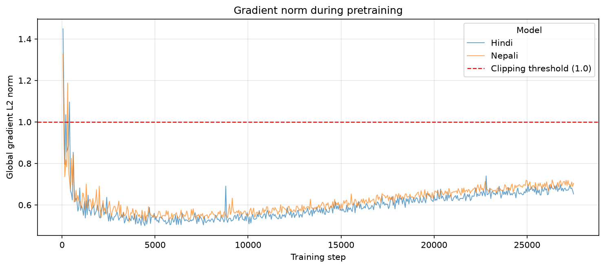

Validation loss fell monotonically with no divergence, no loss spikes, and no clipping events.
Throughput held at ~22,200 tokens/second on the P100 for both models.

| Step | Hindi val loss | Hindi ppl | Nepali val loss | Nepali ppl |
|---|---|---|---|---|
| 500 | 4.9877 | 146.59 | 5.3071 | 201.77 |
| 5,500 | 3.6249 | 37.52 | 3.7911 | 44.30 |
| 10,500 | 3.4645 | 31.96 | 3.6227 | 37.44 |
| 15,500 | 3.3706 | 29.10 | 3.5141 | 33.59 |
| 20,500 | 3.2951 | 26.98 | 3.4326 | 30.96 |
| 25,500 | 3.2505 | 25.80 | 3.3818 | 29.43 |
| **27,500** | **3.2411** | **25.56** | **3.3731** | **29.17** |


---

## 4. Results, Intrinsic Language Modelling

Measured over the **complete** test split, in sequential non-overlapping windows so every token is
scored exactly once. Random sampling would weight some tokens more than others and make the result
depend on the seed.

### 4.1 Headline numbers

| Metric | Model H (Hindi) | Model L (Nepali) |
|---|---|---|
| Tokens scored | 51,399,168 | 56,785,408 |
| Cross-entropy (nats/token) | 3.1942 | 3.3968 |
| **Perplexity** | **24.39** | 29.87 |
| Bytes per token | 9.7857 | 10.6530 |
| **Bits per byte** | 0.4709 | **0.4600** |
| Effective compression vs raw text | 16.99× | 17.39× |

### 4.2 What these numbers mean

**Perplexity** is the model's average "surprise", expressed as an effective number of equally likely
choices. A perplexity of 24.39 means that at each position the model is about as uncertain as if it
were choosing uniformly among 24 tokens, out of a vocabulary of 10,000. An untrained model scores
~10,000. So the model has narrowed its uncertainty by a factor of roughly 400.

**Bits per byte** treats the model as a compressor: how many bits are needed, on average, to encode
each byte of raw text. Storing text raw costs 8 bits/byte. At 0.4709, Model H could in principle
compress its test text to about 6% of its original size, roughly 17× compression.

### 4.3 Why the two metrics disagree, and which to believe

Perplexity favours Hindi (24.39 against 29.87). Bits-per-byte favours Nepali (0.4709 against 0.4600).
Both cannot be right, and the reason is that perplexity is measured per *token* while the two models
tokenize differently. From Phase 1:

| | Hindi | Nepali |
|---|---|---|
| Fertility | 1.34 tokens/word | 1.59 tokens/word |
| Bytes per token | 9.79 | 10.65 |

A Nepali token carries 8.9% more text. Predicting it is a harder prediction, so the perplexity is
higher, but that says something about the unit rather than about the model. Bits-per-byte divides by
the byte instead, which both models share, and on that measure Model L comes out 2.3% ahead.

I would not lean on that 2.3% too heavily. Training Model H for a second epoch brings it to 0.4624
and the gap falls to 0.5% (Section 10), so most of the difference was training budget rather than
anything about the corpora. The safer conclusion is that the two models are near-indistinguishable at
this scale.

Note also that BPB only compares within a script. Devanagari takes 3 UTF-8 bytes where ASCII takes 1,
which inflates the denominator, so these numbers cannot be set against an English BPB.


---

## 5. Results - Generation Quality

128 held-out prefixes of 128 tokens each; the model continues for 128 tokens; the continuation is
scored against the true continuation from the corpus. The same prefixes are used for every decoding
setting, so any difference is caused by the decoder rather than by the prompts.

### 5.1 The decoding sweep

Twelve settings, chosen to separate three effects rather than to enumerate combinations blindly:
does **temperature** alone suffice, does **truncation** (top-k / top-p) beat lowering temperature,
and does an **explicit anti-repetition** mechanism beat both?

Six decoders were implemented from scratch in `lmagpt/model.py`:

| Strategy | What it does |
|---|---|
| temperature | divides the logits - below 1 sharpens, above 1 flattens |
| top-k | keep the k highest-probability tokens |
| top-p (nucleus) | keep the smallest set whose probability sums to p |
| repetition penalty | move already-produced tokens' logits toward -inf |
| no-repeat n-gram | hard-block any token completing an existing n-gram |
| greedy | always take the argmax |

Two implementation details that are easy to get wrong, both pinned by tests. **Repetition penalty
must handle signs separately** - dividing a *negative* logit by the penalty makes it larger and
rewards the repetition it is meant to suppress, so positive logits are divided and negative ones
multiplied. **Top-p must never mask everything** - if the top token alone exceeds p, a naive
`cumsum > p` filter drops every candidate; the shift keeps the crossing token so at least one always
survives.

#### Model H (Hindi)

| Decoding | BLEU | chrF++ | ROUGE-L | rep-4 | distinct-1 | distinct-2 |
|---|---|---|---|---|---|---|
| `greedy` | 13.602 | 13.811 | 10.929 | 0.7562 | 0.0709 | 0.1495 |
| `greedy+norepeat4` | 19.666 | 18.734 | 13.443 | 0.0004 | 0.1655 | 0.5067 |
| `T0.5` | 18.767 | 17.965 | 13.399 | 0.3329 | 0.1409 | 0.4139 |
| `T0.8` | 23.082 | 21.448 | 13.306 | 0.0335 | 0.257 | 0.7218 |
| `T1.0` | 22.939 | 21.478 | 12.103 | 0.0029 | 0.3296 | 0.8311 |
| `T1.5` | 14.667 | 18.095 | 6.936 | 0.0 | 0.5373 | 0.9811 |
| `T1.0+topk50` | 23.868 | 21.801 | 13.332 | 0.0194 | 0.2212 | 0.7278 |
| `T1.0+topp0.9` | 23.265 | 21.684 | 13.188 | 0.009 | 0.29 | 0.7933 |
| `T1.0+topp0.95` **<-** | **22.908** | **21.44** | 12.728 | **0.0106** | 0.3122 | **0.8147** |
| `T0.8+topp0.9` | 22.531 | 20.892 | 13.417 | 0.0809 | 0.2013 | 0.6346 |
| `T0.8+topp0.9+rep1.2` | 23.441 | 21.786 | 12.276 | 0.0058 | 0.2498 | 0.7535 |
| `T0.8+topp0.9+norepeat4` | 23.247 | 21.408 | 13.406 | 0.0 | 0.2226 | 0.7038 |
| _**human reference**_ | - | - | - | _0.0087_ | _0.3218_ | _0.8206_ |

#### Model L (Nepali)

Same 12 settings; the rows that carry the argument are shown, all of them in
`evaluation_test.json`.

| Decoding | BLEU | chrF++ | ROUGE-L | rep-4 | distinct-1 | distinct-2 |
|---|---|---|---|---|---|---|
| `greedy` | 13.493 | 13.028 | 7.374 | 0.7333 | 0.1209 | 0.2034 |
| `greedy+norepeat4` | 19.428 | 17.337 | 9.137 | 0.0021 | 0.2882 | 0.6755 |
| `T0.5` | 18.084 | 16.286 | 8.735 | 0.2992 | 0.2367 | 0.5044 |
| `T1.0` **<-** | **24.613** | **20.718** | 8.537 | **0.0031** | 0.5095 | **0.9229** |
| `T1.5` | 17.7 | 18.546 | 3.807 | 0.0 | 0.6216 | 0.9929 |
| `T0.8+topp0.9+rep1.2` | 24.814 | 21.002 | 8.527 | 0.0092 | 0.424 | 0.8804 |
| _**human reference**_ | - | - | - | _0.0018_ | _0.4949_ | _0.9181_ |

### 5.2 How the "sweet spot" was defined

Neither obvious rule works: **maximising diversity** picks T=1.5, whose distinct-2 exceeds *human*
text and produces near-nonsense; **maximising BLEU** rewards agreement with one arbitrary reference.

The rule used here: **score the reference continuations themselves**, then rank settings by distance
from those human statistics on rep-4 and distinct-2, chrF++ breaking ties. The decoder should match
real text's repetition and variety, not exceed it.

| | Hindi | Nepali |
|---|---|---|
| Human rep-4 | 0.009 | 0.002 |
| Human distinct-2 | 0.821 | 0.918 |
| **Best setting** | **T=1.0 + top-p 0.95** | **T=1.0** |
| Its rep-4 / distinct-2 | 0.011 / 0.815 | 0.003 / 0.923 |

Both land within **1%** of human text on both axes. Notably the chrF++-optimal setting is *not* the
natural one, Hindi's highest is `T1.0+topk50` (21.80) but sits 0.103 from human statistics, against
the winner's 21.44 at 0.008. Without the reference baseline, top-k would have been chosen.

### 5.3 What each metric is, and how far to trust it

**BLEU** counts matching n-grams, here with **character-level** tokenization rather than the default
`13a`, that tokenizer is built for Latin script and treats a whole Devanagari word as one token,
collapsing BLEU-4 toward zero.

**chrF++** compares character n-grams plus short word n-grams, and is **the most trustworthy of the
three here**: Hindi and Nepali are morphologically rich, so a correct stem with the wrong case suffix
is largely correct, and character n-grams degrade gracefully where a word-level metric scores a total
miss.

**ROUGE-L** measures longest common subsequence, implemented directly rather than via `rouge_score`,
whose pipeline applies English stemming meaningless for Devanagari.

**The caveat covering all three:** each compares against *one* reference, and open-ended generation
has no single correct answer. **Absolute values are not meaningful**, only relative comparison
across settings with the reference held fixed. **Repetition rate** and **distinct-n** are reported
alongside because degenerate looping is nearly invisible to BLEU against a single reference.

### 5.4 Generation examples

Both prompts below are hand-written rather than drawn from the corpus. Corpus-continuation samples
are in `generation_examples.json` and `generation_session.jsonl`.

#### Model H, best Hindi checkpoint (two epochs, step 55,012), T=0.8

> **Prompt:** प्रधानमंत्री ने नई शिक्षा नीति के बारे में कहा कि इसका उद्देश्य देश की शिक्षा व्यवस्था को अधिक आधुनिक और प्रभावी बनाना है। उन्होंने कहा कि
>
> **Generated:** कम से कम 15वीं कक्षा के छात्रों को इस नीति के तहत राष्ट्रीय शिक्षा नीति का लाभ मिलना चाहिए। राष्ट्रीय शिक्षा नीति देश की सबसे बड़ी शिक्षा नीति है। शिक्षा व्यवस्था को नई दिशा देना भी सरकार का लक्ष्य है। शिक्षा प्रणाली के नए मानक हैं। उन्होंने कहा कि राष्ट्रीय शिक्षा नीति 2020 के तहत राष्ट्रीय शिक्षा नीति प्रारंभ की गई है। इसके तहत शिक्षा का स्तर पूरी तरह से बंद हो गया

Form is learned; content is not. It holds topic and the reported-speech frame for six sentences
and names **राष्ट्रीय शिक्षा नीति 2020**, the real policy, learned from the corpus rather than given in
the prompt. But **15वीं कक्षा** ("15th grade") does not exist in Indian schooling, which ends at 12,
and *शिक्षा का स्तर पूरी तरह से बंद हो गया* is grammatical yet incoherent, *बंद होना* cannot take *स्तर*
as its subject.

#### Model L, Nepali, T=0.8

> **Prompt:** लगातारको वर्षाका कारण नेपालको केही क्षेत्रमा बाढी र पहिरोको जोखिम बढेको छ। स्थानीय प्रशासनले नागरिकलाई
>
> **Generated:** सावधानी अपनाउन र नजान आग्रह गरेको छ। उसले पानीको सतह 4 सय 10 मिटरबाट 5 सय 50 मिटरसम्म पुगेको र बढीमा 3 सय 60 मिटरसम्म एक्कासि पानी जम्ने जनाएको छ। यस्तै, बाढी, पहिरो र डुबानको जोखिमको हुने क्षेत्रमा पनि बाढी र पहिरो र पहिरोको जोखिम बढेको छ। साथै, बाढी तथा पहिरोको जोखिमको विरुद्धमा

Grammatically exact. The prompt ends on the dative *नागरिकलाई*, obligating a verb that takes a
dative object; the model supplies *आग्रह गरेको छ* ("has urged") with the correct
infinitive-plus-*आग्रह गर्नु* construction and the present-perfect *-एको छ* of official Nepali
announcements, and picks *डुबान*, the specific term for flood submersion. The numbers are incoherent
(410 m → 550 m but "at most" 360 m) and the last sentence loops into *बाढी र पहिरो र पहिरोको*.

Both models fail the same way on independent corpora and tokenizers: **register and morphology
learned, factual and numerical coherence not**, a property of scale, not of either dataset
(Section 10).

`python scripts/generate.py` opens an interactive session where decoding settings change
mid-conversation, logging every turn with the configuration that produced it.

---

## 6. Results, Attention Analysis

Implementation: [`lmagpt/attention.py`](../../lmagpt/attention.py). This section is only possible
because attention was implemented from primitives, the post-softmax `(B, h, T, T)` matrix is
available directly, where a fused kernel would never materialise it.

**A methodological note.** Heatmaps use short sentences (13 and 9 tokens) because a 512×512 grid is
unreadable. The *statistics*, however, run over **16 held-out passages of 256 tokens each**. This
matters: mean attention distance is bounded by sequence length, query *t* can reach back at most *t*
tokens, so computing it on a 13-token sentence measures the causal mask rather than the model. Doing
so initially gave 3.4 tokens; over proper passages the true figure is **35.0**.

### 6.1 Heatmaps

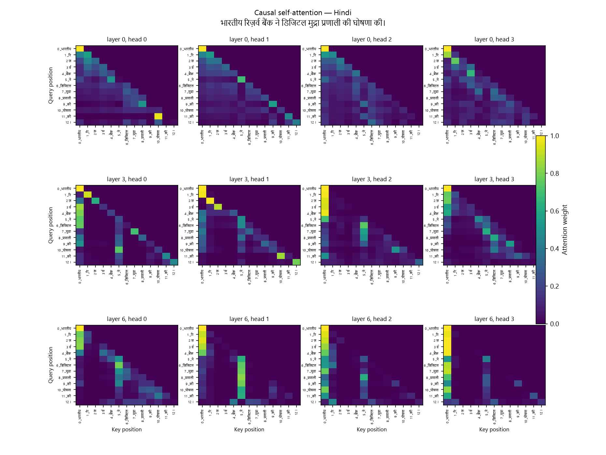

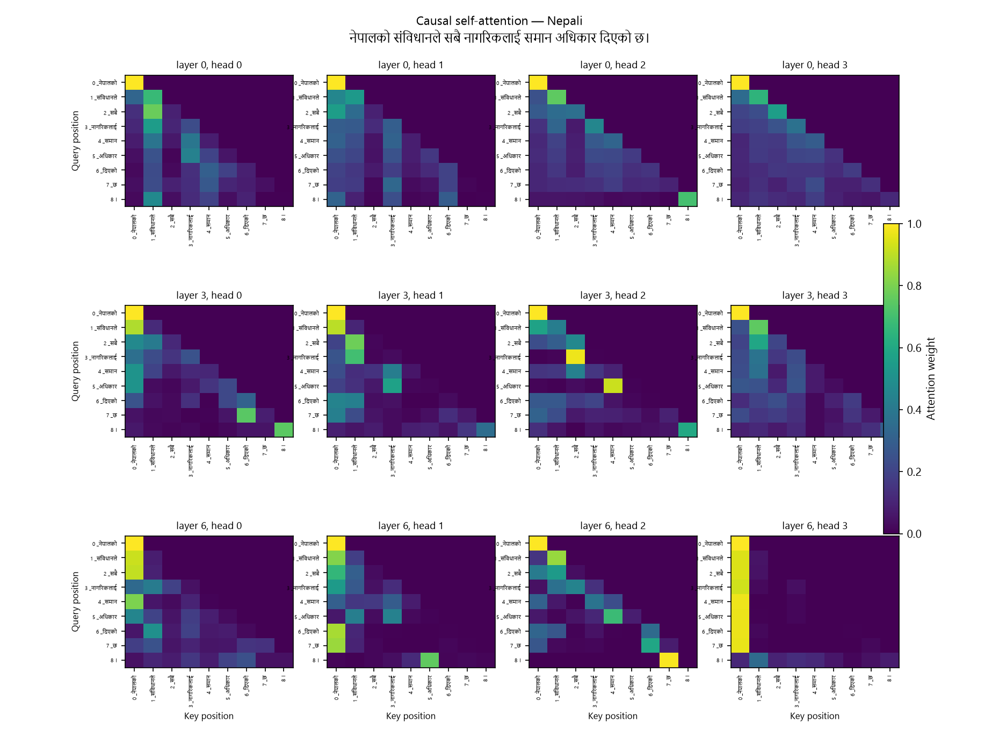

Query position on the vertical axis, key position on the horizontal. Every map is strictly
lower-triangular, the visual confirmation of causal masking.

### 6.2 Entropy and distance per head

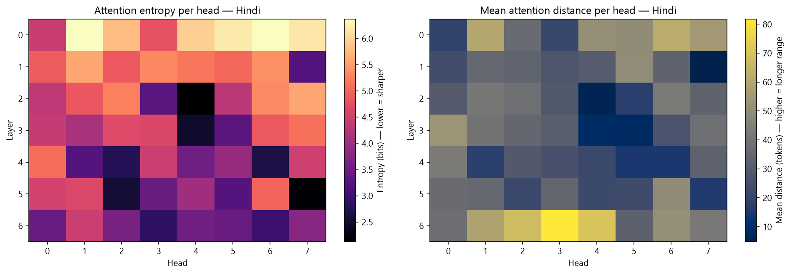

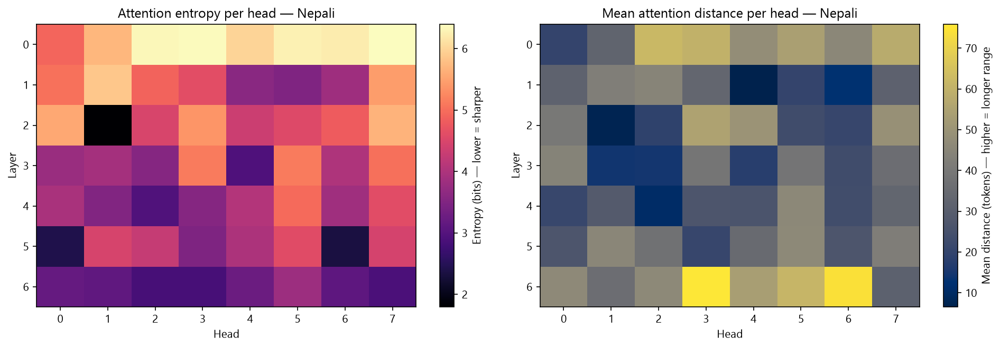

**Entropy** is `−Σ p log₂ p` over each query's attention distribution. A head attending to exactly one
position scores ~0 bits; one spreading uniformly over *t* positions scores `log₂ t`. Low entropy means
a sharp, selective head.

**Mean attention distance** is `Σₖ p(k)·(q−k)`, how far back a head looks on average.

### 6.3 The clearest finding: attention sharpens with depth

| Layer | 0 | 1 | 2 | 3 | 4 | 5 | 6 |
|---|---|---|---|---|---|---|---|
| **Hindi** entropy (bits) | 5.76 | 4.94 | 4.38 | 4.20 | 3.77 | 3.71 | **3.52** |
| **Nepali** entropy (bits) | 6.03 | 4.60 | 4.57 | 4.19 | 3.94 | 3.75 | **3.14** |

Entropy falls **monotonically** through the stack in both models. Layer 0 attends broadly, close to
uniform over the available context; each subsequent layer narrows; the final layer is sharpest.

This is the classic division of labour: **early layers gather context indiscriminately, deep layers
select specific tokens.** Both models learned it independently, from different corpora, with no
architectural pressure to do so, good evidence the implementation behaves as intended.

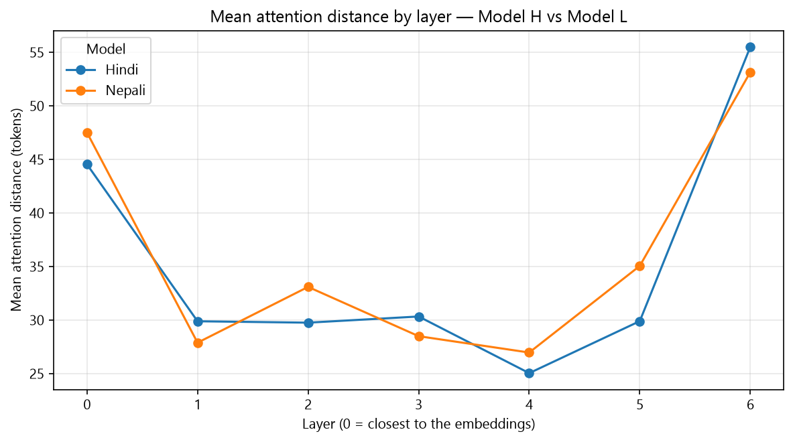

| Layer | 0 | 1 | 2 | 3 | 4 | 5 | 6 |
|---|---|---|---|---|---|---|---|
| **Hindi** distance (tokens) | 44.5 | 29.9 | 29.8 | 30.3 | 25.1 | 29.9 | **55.5** |
| **Nepali** distance (tokens) | 47.5 | 27.9 | 33.1 | 28.5 | 27.0 | 35.1 | **53.2** |

Distance is **U-shaped**: broad in layer 0, contracting through the middle layers, then reaching
furthest in the final layer. The middle of the network does local work; the last layer pulls in
long-range context immediately before the prediction.

### 6.4 Head specialisation

Classifying each of the 56 heads by where it sits in the (entropy, distance) plane:

| Type | Hindi | Nepali |
|---|---|---|
| Local / positional (sharp, nearby) | 18 | 19 |
| Diffuse global (broad, far) | 18 | 19 |
| Diffuse local | 10 | 9 |
| Long-range selective (sharp, far) | 10 | 9 |

Both models converged on nearly identical distributions. The largest groups are the two extremes, sharp local heads doing positional or syntactic work, and broad global heads maintaining topical
context, with a smaller population of sharp long-range heads, the type usually associated with
retrieving specific earlier tokens.


---

## 7. Model H vs Model L, Resource-Tier Comparison

### 7.1 What actually differs

Everything except the data was held constant: identical architecture, identical hyperparameters,
identical training budget, identical code. The two corpora are close in size (450.7M vs 453.3M
training tokens), so this is not a data-volume comparison.

| | Model H (Hindi) | Model L (Nepali) | Verdict |
|---|---|---|---|
| Perplexity | **24.39** | 29.87 | H better, but see Section 4.3 |
| Bits per byte | 0.4709 | **0.4600** | **L better** |
| Tokenizer fertility | 1.34 tok/word | 1.59 tok/word | H more efficient |
| Best BLEU | 22.94 | **24.61** | L marginally better |
| Best chrF++ | **21.48** | 20.72 | H marginally better |
| Attention entropy (final layer) | 3.52 bits | **3.14 bits** | L sharper |

**The two models are much closer than the resource-tier framing predicts.** On the tokenizer-neutral
measure, the lower-resource model is very slightly ahead.

### 7.2 Why the gap is small, and what limits both models

Train loss (3.30) is *higher* than validation loss (3.24). , an inverted gap caused by dropout
being active in training and disabled at evaluation. So **neither model is overfitting**; both are
undertrained. Validation was still improving at step 27,500 and flattened only because the cosine
schedule had annealed the learning rate to its floor. Both models are **compute-limited, not
data-limited or capacity-limited**, which is why the resource-tier difference is muted: neither has
extracted everything its corpus offers, so corpus *quality* has not had room to express itself.

Two honest limitations follow:

1. **`dropout = 0.1` was the wrong choice**, it regularises against overfitting that does not occur.
2. **A single epoch is not enough, and this was measured.** Model H was continued to a second full
   epoch (55,012 steps) by extending `max_steps` and resuming: test perplexity 24.39 → **23.02**
   (−5.6%), bits-per-byte 0.4709 → **0.4624** (−1.8%), validation still descending at the end.

   Extending the schedule is the essential part, resuming with `max_steps` unchanged does nothing,
   since `step < max_steps` is already false. Raising it recomputes the cosine curve so the learning
   rate restarts at 3.34e-4 rather than the 6e-5 floor: a **warm restart** (SGDR). Validation first
   *worsens* to 28.20 before recovering past baseline near step 42,000, which is why the gain is 5.6%
   rather than what extrapolating the first epoch's slope would predict. Artifacts in `hindi_2ep/`.

### 7.3 What Phase 1 factors most affected the lower-resource model

**Tokenizer fertility is the dominant factor.** Nepali needs 1.59 tokens per word against Hindi's
1.34, an 18% penalty. Nepali attaches case markers directly to the noun stem as bound clitics
(*-हरूलाई*, *-बाट*, *-भन्दा*), producing longer orthographic words, where Hindi uses free-standing
postpositions separated by whitespace. The same vocabulary size therefore buys less compression.

The consequences run through everything in this report: Nepali sequences carry fewer words per
512-token window, its per-token perplexity is measuring a harder prediction, and its raw perplexity
looks worse while its bits-per-byte is better.

A second Phase-1 factor worth recording: **Nepali's test split is 11.6% manual against 21.7% for
validation**, a consequence of group-aware splitting over a limited number of `(source, month)`
groups. The test set's register mix therefore differs from validation's, which is a caveat on the
Nepali test figures specifically.


---

## 8. Vocabulary Sweep, Testing the Phase-1 Tokenizer Choice

Phase 1 chose V=10,000 on a theoretical argument about embedding cost. This section tests that
choice empirically, in **both** languages, by retraining at V=5,000 and V=8,000 and comparing on
bits-per-byte.

### 8.1 The design decision that makes the experiment meaningful

**Parameter count is held constant, not architecture.** Embeddings are `vocab × d_model`, so at a
fixed `d_ff` a larger vocabulary is simply a larger model (22.79M at V=5,000 against 28.42M at
V=16,000) and would win partly on size. Instead `d_ff` absorbs the difference:

| | `d_ff` | Parameters | vs budget | Train tokens | Steps (1 epoch) |
|---|---|---|---|---|---|
| V=5,000 | 2176 | 25,546,112 | +0.77% | 496.0M / 512.3M | 30,273 / 31,266 |
| V=8,000 | 1920 | 25,245,312 | −0.42% | 463.1M / 469.7M | 28,266 / 28,668 |
| V=10,000 | 1792 | 25,350,912 | ±0.00% | 450.7M / 453.3M | 27,506 / 27,500 |

Hindi / Nepali where they differ. Every run is within ±0.8% of the budget, so vocabulary trades
against FFN width rather than model size; corpus, hyperparameters and seed are otherwise identical.

**Step counts differ by design.** A smaller vocabulary emits more tokens for the same text, so one
epoch takes more steps. A fixed step count would have given the small-vocabulary runs less than a
full pass, confounding tokenizer quality with training budget.

Throughput varies under 2.5% across the sweep (21,674–22,224 tok/s) despite `d_ff` ranging
2176→1792, because tied embeddings make the output projection's `d_model × V` cost grow exactly as
the FFN's shrinks. The runs differ in wall clock (5.63–6.56 h) only through step count.

### 8.2 Results

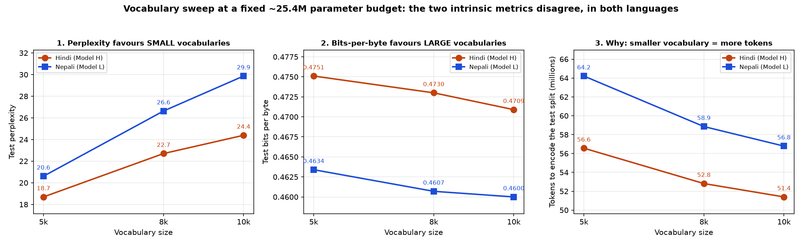

#### Model H (Hindi)

| | V=5,000 | V=8,000 | V=10,000 |
|---|---|---|---|
| Test cross-entropy (nats) | 2.9283 | 3.1225 | 3.1942 |
| **Test perplexity** | **18.70** | 22.70 | 24.39 |
| Tokens to encode the test split | 56,563,712 | 52,815,360 | 51,399,168 |
| Bytes per token | 8.8922 | 9.5233 | 9.7857 |
| **Test bits-per-byte** | 0.4751 | 0.4730 | **0.4709** |
| Compression vs raw | 16.84× | 16.91× | 16.99× |
| Best chrF++ | 21.55 | 21.24 | 21.80 |
| Sweet spot | T=1.0 | T=1.0 | T=1.0+top-p 0.95 |

#### Model L (Nepali)

| | V=5,000 | V=8,000 | V=10,000 |
|---|---|---|---|
| Test cross-entropy (nats) | 3.0258 | 3.2823 | 3.3968 |
| **Test perplexity** | **20.61** | 26.64 | 29.87 |
| Tokens to encode the test split | 64,213,504 | 58,856,960 | 56,785,408 |
| **Test bits-per-byte** | 0.4634 | 0.4607 | **0.4600** |
| Best chrF++ | 19.64 | 21.15 | 21.00 |
| Sweet spot | T=1.0 | T=1.0 | T=1.0 |

### 8.3 The finding: the two metrics rank the models in opposite orders

Perplexity ranks these models 5,000 > 8,000 > 10,000. Bits-per-byte ranks them in exactly the
reverse order. The checkpoints are the same, the text is the same, and the reversal happens in both
languages.

The token-count row explains it. A smaller vocabulary cuts the same text into more and smaller
pieces: Hindi V=5,000 needs 10.0% more tokens than V=10,000, Nepali 13.1% more. Each of those
predictions is individually easier, which per-token perplexity rewards, and it never accounts for the
fact that more of them are needed to cover the same text. Bits-per-byte divides by bytes and the
tokenizer cancels out.

This is the version of the Section 4.3 argument worth trusting. There, Hindi and Nepali differ in
corpus as well as tokenizer, so someone could reasonably blame the data. Here the corpus is
byte-identical and the parameter budget fixed, so the tokenizer is the only thing that moves, and the
reversal still shows up in two languages across three tokenizers each.

### 8.4 Does the Phase-1 choice hold up?

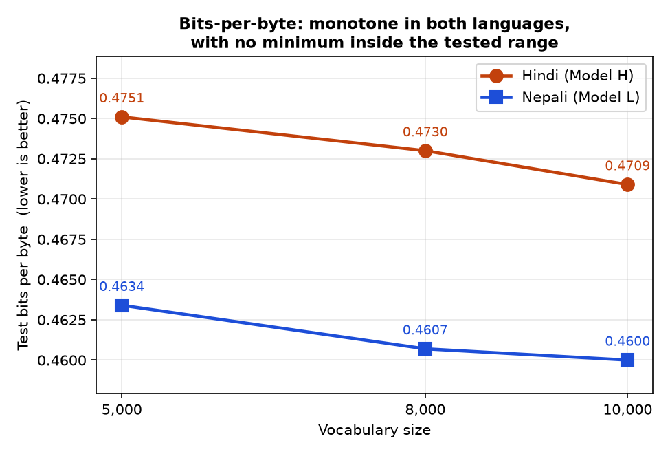

V=10,000 is the best of the three tested, in both languages. That is a narrower claim than "V=10,000
is optimal", and the difference matters.

The curve has no minimum in it. Bits-per-byte falls steadily across the whole tested range and is
still falling at V=10,000, so nothing here rules out V=16,000 being better again. V=16,000 was
prepared but never run, which leaves the upper side untested. What the data supports is that
V=10,000 beats the smaller alternatives, not that it is the best possible choice.

The margins are also small: 0.89% end to end for Hindi (0.4751 to 0.4709) and only 0.34% for Nepali,
from one seed at one epoch on models that had not converged. What gives the result weight is not any
single gap but that the ordering is monotone and comes out identical across two independent
languages, corpora and tokenizers.

Nepali's spread being about a third of Hindi's fits Section 7.3. Its fertility is 1.59 tokens/word
against Hindi's 1.34 because case markers attach as bound clitics, so it needs more tokens per word
whatever the vocabulary and gains less from enlarging it.

### 8.5 Generation quality across the sweep

Flat. Best chrF++ spans 21.24–21.80 (Hindi) and 19.64–21.15 (Nepali) with no consistent ordering, Hindi's best is at V=10,000, Nepali's at V=8,000. Against a single reference with 64 samples these
gaps are noise: **vocabulary size measurably changes intrinsic language modelling and does not
measurably change generation quality at this scale.**

**One result reproduces across all six models:** greedy degenerates, rep-4 between 0.720 and 0.752
against human references of 0.002–0.009, and `no_repeat_ngram_size=4` drives it to ~0 every time. Six
models, two languages, three tokenizers, a property of the model class, not of any one run. Samples
in `vocab_sweep/*/evaluation_test.json`.

### 8.6 Reproducing the sweep

```bash
# encode + write configs (one epoch derived from each encoding's token count)
python scripts/make_vocab_sweep.py --lang hindi  --vocabs 5000 8000
python scripts/make_vocab_sweep.py --lang nepali --vocabs 5000 8000

# train (Kaggle)
python scripts/kaggle_run.py vocab --vocab 5000 --lang hindi
python scripts/kaggle_run.py vocab --vocab 8000 --lang nepali

# evaluate against each run's OWN tokenization -- the --data-dir/--tokenizer
# overrides are essential: scoring against the default V=10,000 binaries would
# silently produce meaningless numbers, since only the token ids differ
python -m lmagpt.evaluate --lang hindi --split test \
       --checkpoint "report/Phase 2/vocab_sweep/vocab_5000/checkpoints/last.pt" \
       --data-dir hindi/data/tokens_v5000 \
       --tokenizer hindi/tokenizer/hi_unigram_5000.model \
       --out "report/Phase 2/vocab_sweep/vocab_5000"

python scripts/plot_vocab_sweep.py
```

`lmagpt/evaluate.py` guards this: it aborts if the checkpoint's `vocab_size` disagrees with the token
directory's `meta.json`, so a mismatched evaluation fails loudly rather than returning a plausible
wrong number.

Artifacts: `vocab_sweep/{vocab,ne_vocab}_{5000,8000}/evaluation_test.json`, their
`checkpoints/train_log.jsonl`, and `figures/vocab_sweep*.png`.

---

## 9. Bonus - Ablation: No Positional Encoding

The optional bonus asks for one language retrained with positional embeddings removed, evaluated with
the full Phase-2 suite, and compared against the standard model. Model H (Hindi) was used.

### 9.1 Why this ablation is unusually clean

RoPE contributes **no parameters** - it is a rotation applied to queries and keys, built from
precomputed cos/sin buffers. Removing it therefore leaves the model at **exactly 25,350,912
parameters**, identical to the baseline.

This matters. A learned positional table would have cost 262,144
parameters, so removing it would have changed capacity *and* positional information together, and any
measured difference would be partly a capacity effect. Here the two are separated: same parameter
count, same data, same hyperparameters, same 27,500 steps, same seed. The single difference is
`use_rope: false` in `hindi/configs/model_norope.yaml`.

### 9.2 Results

| | Baseline (RoPE) | Ablated (no positional) | Change |
|---|---|---|---|
| Parameters | 25,350,912 | 25,350,912 | 0 |
| Test cross-entropy | 3.1942 | 3.3225 | +0.128 nats |
| **Test perplexity** | **24.39** | **27.73** | **+13.7%** |
| Test bits-per-byte | 0.4709 | 0.4898 | +4.0% |
| Compression vs raw | 16.99x | 16.33x | worse |
| Best chrF++ | 21.80 | 21.89 | ~equal |
| Best BLEU | 23.87 | 23.72 | ~equal |
| Sweet spot | T=1.0+top-p 0.95 | T=1.0+top-p 0.95 | unchanged |

Scored over the complete 51,399,168-token test split.

### 9.3 What breaks - and what does not

**Language modelling degrades measurably: +13.7% perplexity.** That is the cost of explicit position.

**Generation quality barely moves.** Best chrF++ is 21.89 ablated against 21.80 with RoPE -
indistinguishable. Both models select the same sweet spot. Against a single reference, over 128-token
continuations, the metrics simply cannot see what position contributes.

**And the model does not collapse.** 27.73 perplexity against roughly 10,000 for an untrained model:
it still learned Hindi well. This is the interesting part, and it was predicted before training by
three unit tests.

### 9.4 Why removing positional encoding does not make the model order-blind

The causal mask is *itself* positional information. Token *t* can attend to exactly *t* predecessors,
so the count of preceding tokens is available to the network even with no positional encoding at all.

This is demonstrable, and `tests/test_model.py` pins it:

| Layers | Logit change when the prefix is permuted |
|---|---|
| 1 | 5.96e-08 (float32 noise - genuinely invariant) |
| 2 | 1.31e-02 |
| 4 | 8.07e-03 |
| 7 | 1.57e-02 |

With a **single** layer the last position attends over its prefix as an unordered set, so permuting
the prefix provably cannot change the output. From **layer 2 onward** each position attends over
representations built from *its own* prefix, and permuting the sequence changes those prefixes.
Depth converts the mask's implicit position count into usable positional signal.

This matches the published result that decoder-only language models without positional encodings
still learn positional information (Haviv et al., 2022).

### 9.5 The mechanism, visible in attention

Comparing per-layer attention statistics over 16 held-out 256-token passages:

| Layer | Entropy (RoPE) | Entropy (none) | Distance (RoPE) | Distance (none) |
|---|---|---|---|---|
| 0 | 5.76 | 6.17 | 44.5 | **62.3** |
| 1 | 4.94 | 5.09 | 29.9 | **56.5** |
| 2 | 4.38 | 5.96 | 29.8 | **56.2** |
| 3 | 4.20 | 4.82 | 30.3 | 41.8 |
| **4** | 3.77 | **2.98** | 25.1 | **5.4** |
| **5** | 3.71 | **2.66** | 29.9 | **9.0** |
| 6 | 3.52 | 4.33 | 55.5 | 59.4 |

Two changes, both consistent:

**Early layers go global and diffuse.** Layers 0-2 stretch from about 30 to 56-62 tokens with *higher*
entropy. Unable to localise, they attend broadly.

**Layers 4-5 become extremely sharp and extremely local.** Mean distance collapses from about 27
tokens to **5.4 and 9.0**, and entropy drops to 2.66 bits - well *below* the baseline's 3.71. The
network has dedicated two mid-stack layers to reconstructing local order from the only signal
available: the causal mask.

Head specialisation shifts the same way. The baseline's balanced 18 / 18 / 10 / 10 split across
local-positional, diffuse-global, diffuse-local and long-range-selective becomes a polarised
21 / 21 / 7 / 7 - fewer heads in the intermediate categories.

### 9.6 Conclusion

Removing positional encoding does not disable the model; it forces the model to **spend capacity
rebuilding position** from the causal mask. Two of seven layers reorganise into short-range order
detectors, and that reallocation - not an inability to represent order - is what costs 13.7%
perplexity.

A practical corollary: at this scale, explicit positional encoding is worth roughly one eighth of the
model's language-modelling performance, and RoPE delivers it for free in parameters.

### 9.7 Reproducing the ablation

```bash
# train (Kaggle)
python -m kaggle kernels push -p kaggle/train_hindi_norope

# or locally
python -m lmagpt.train --lang hindi --config hindi/configs/model_norope.yaml \
                       --out hindi_norope/checkpoints

# evaluate
python -m lmagpt.evaluate --lang hindi --split test \
       --checkpoint hindi_norope/checkpoints/last.pt --out "report/Phase 2/ablation"

python -m lmagpt.attention --lang hindi --checkpoint-dir hindi_norope/stage \
       --stats-tokens 256 --stats-passages 16 --out "report/Phase 2/ablation"
```

Artifacts: `ablation/evaluation_test.json`, `ablation/attention_analysis.json`,
`ablation/figures/*.png`, `logs/hindi_norope_train_log.jsonl`.


---

## 10. Limitations

1. **Both models are undertrained**, and Section 8 quantifies the cost. One epoch; validation loss still
   falling at the end (Section 7.2). A second epoch on Model H recovers 5.6% perplexity and 1.8%
   bits-per-byte, and the curve is *still* descending at 55,012 steps. The headline figures
   throughout this report are the 1-epoch ones, so that both languages and all six sweep models
   remain compared at an equal training budget.
2. **Dropout 0.1 was inappropriate** for a non-overfitting regime and probably cost accuracy.
3. **Bits-per-byte is not cross-script comparable.** These figures cannot be set against English BPB.
4. **Factual reliability is low.** Expected at 25M parameters; the models are locally coherent and
   globally unreliable.


---

## 11. Reproduction

```bash
# Unit tests, 63 total (both phases)
python -m pytest tests/ -q

# Train (locally, or on Kaggle via the driver below)
python -m lmagpt.train --lang hindi
python -m lmagpt.train --lang nepali

# Headless on Kaggle
python scripts/kaggle_run.py train  --lang hindi --fresh
python scripts/kaggle_run.py status
python scripts/kaggle_run.py fetch  --lang hindi

# Evaluation, intrinsic + generation, full test split
python -m lmagpt.evaluate --lang both --split test --n-samples 128

# Attention analysis
python -m lmagpt.attention --lang both --stats-tokens 256 --stats-passages 16

# Training curves
python scripts/plot_training_curves.py

# Vocabulary sweep figures (Section 8)
python scripts/plot_vocab_sweep.py
```

### Artifacts in this branch

| File | Contents |
|---|---|
| `evaluation_test.json` | perplexity, BPB, BLEU/chrF++/ROUGE-L, diversity, per decoding setting |
| `attention_analysis.json` | per-head entropy and mean distance, head classification |
| `generation_examples.json` | prompts, generations at three settings, references |
| `logs/*_train_log.jsonl` | per-step loss, LR, gradient norm, throughput |
| `figures/*.png` | 13 figures: loss curves, perplexity, LR/throughput, gradient norm, attention, vocabulary sweep |

Model checkpoints (304 MB each) are on Google Drive; links are in the top-level `README.md`.

---
## AI Tools Usage

Claude was used as a supporting tool for parts of the implementation and report writing. However, the implementation and experiments were mainly done by me, and all reported results were obtained from actual runs and verified from the generated logs and output files.

Some AI suggestions were incorrect, so I tested and corrected them during development, including issues with the initialization-loss test, attention-distance analysis, and resumed training.