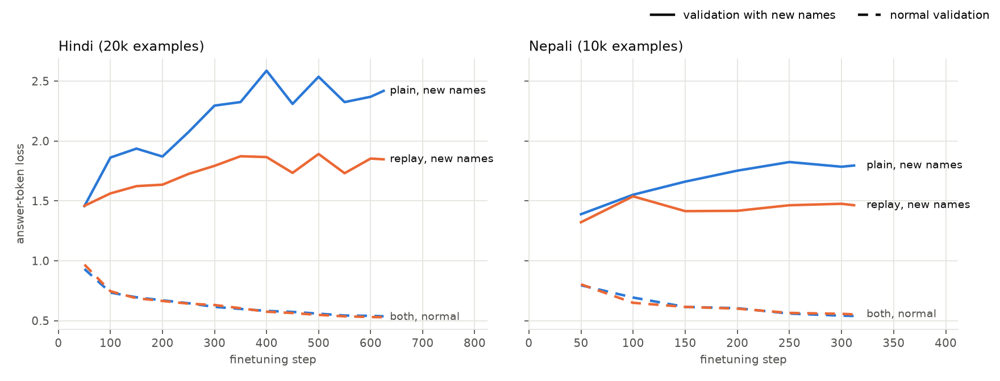
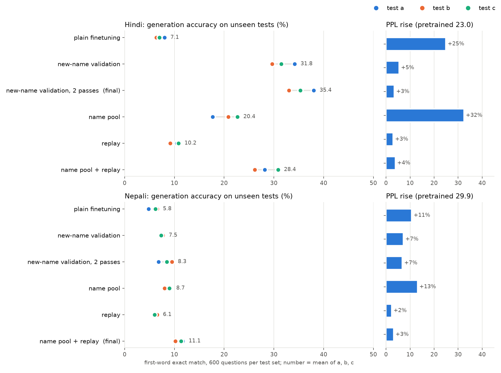
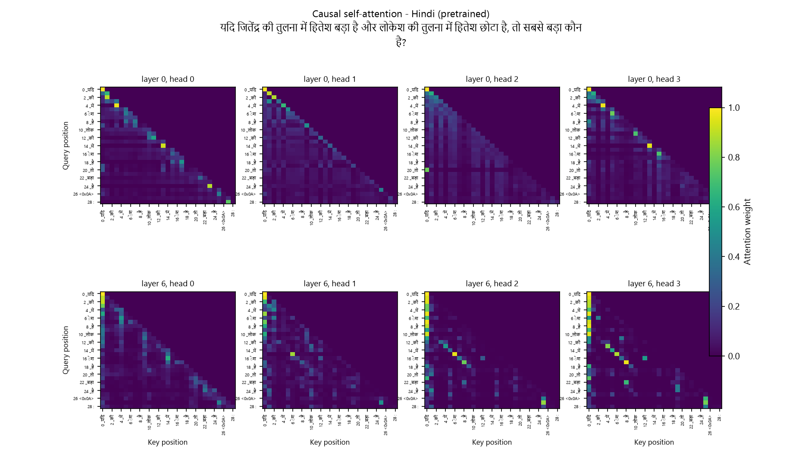
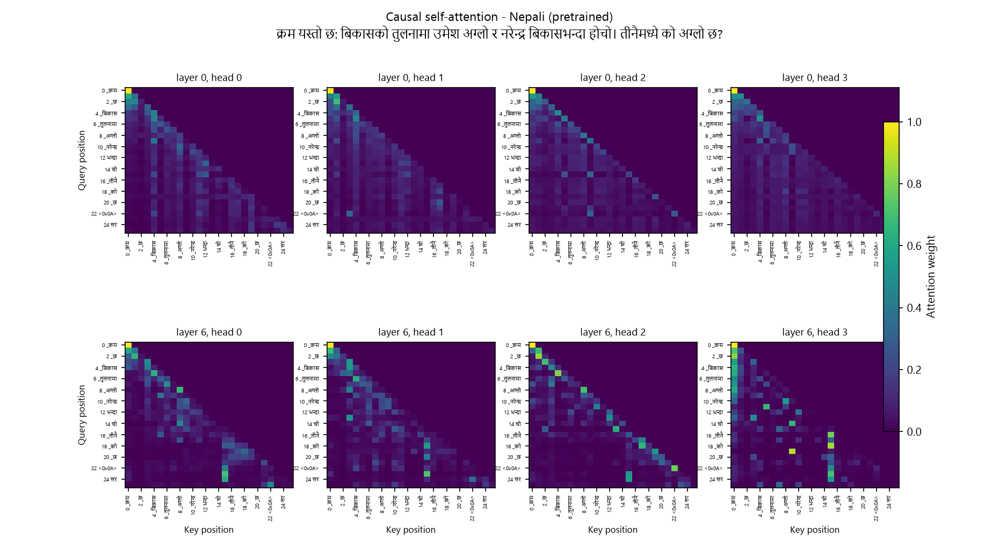
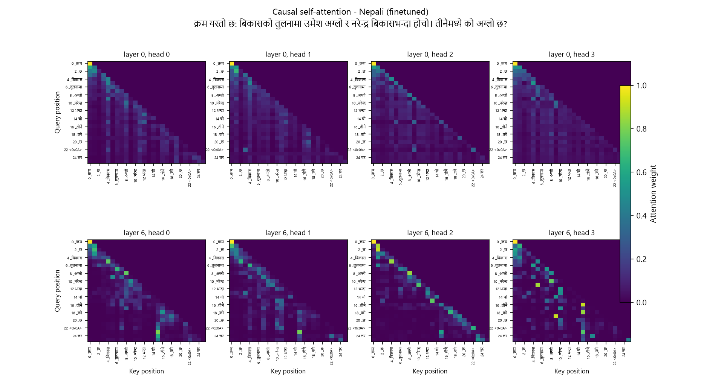

# Phase 3: Finetuning for Comparative Reasoning

**Project:** Monolingual Transformer Language Models for Hindi (Model H) and Nepali (Model L)  
**Course:** Language Models and Agents, Monsoon 2026  
**Author:** Gaurav Patel  
**Branch:** `phase-3`  

> 📘 **Code & Concept Guide**: For a comprehensive, step-by-step breakdown of where each component is implemented in the codebase and the conceptual/mathematical meaning of every metric, SFT loss mask, entity memorization proof, and query attention probe, see [`phase3_implementation_guide.md`](phase3_implementation_guide.md).

---

## 1. Executive Summary

In this phase, I tested whether small (25.4M parameter) monolingual language models can acquire multi-step relational reasoning through Supervised Fine-Tuning (SFT), or if they merely memorize surface templates and shortcuts. 

I generated native synthetic reasoning datasets for Hindi and Nepali, trained both Phase 2 models, and audited both their reasoning accuracy and general language retention.
### Final Models

| Dimension | Hindi (Model H) | Nepali (Model L) |
|---|---|---|
| **Training Size** | 20,000 questions | 10,000 questions |
| **Best Recipe** | Early stopping on new-name validation  | Large name pool (~175 names) + Corpus Replay |
| **Test B Choice Acc** | 37.8% (Chance: 38.5%) | 41.2% (Chance: 38.5%) |
| **Test B Written Acc** | 33.0% (Wrong names: 15%) | 10.2% strict / 26.8% with endings |
| **Language PPL** | 23.81 (Base: 23.02, +3%) | 30.81 (Base: 29.87, +3%) |
| **Checkpoint Path** | `hindi/reasoning/checkpoints/best.pt` | `nepali/reasoning/checkpoints/best.pt` |

---

## 2. Dataset Design & Leakage Control

Questions were generated using `scripts/make_reasoning_data.py` with separate grammatical templates for each language (`hindi/reasoning/templates.py` and `nepali/reasoning/templates.py`).

### 2.1 The 9 Problem Categories

1. **Direct Comparison** (12%): Two entities with explicit values (*"अनिल 18 वर्ष, विजय 25 वर्ष। किसकी उम्र अधिक है?"*).
2. **Numeric Comparison** (12%): Price/quantity comparison with polarity inversion (*"सस्ता कौन है?"*).
3. **Superlative of Three** (12%): Finding the extreme entity among three.
4. **Mixed / Equality** (12%): Values can be equal (*"बराबर"*).
5. **2-Step Chains (Place)** (12%): $A > B > C$, asking for largest, smallest, or middle.
6. **3-Step Chains (Place)** (12%): Four-entity chain asking for extreme or second place.
7. **2-Step Chains (Pair Relation)** (10%): $A > B > C$, asking directly: *"A और C में कौन बड़ा है?"*.
8. **3-Step Chains (Pair Relation)** (8%): Four-entity chain asking about two non-adjacent entities.
9. **Ranking** (10%): Identifying median or specific position (*"बीच में कौन है?"*).

### 2.2 Strict Test Split Isolation

To prevent models from passing via memorization, training and evaluation data were partitioned across three dimensions:

| Dimension | Training Set | Test Sets |
|---|---|---|
| **Entity Names** | 26 disjoint names | 6 held-out names |
| **Numeric Ranges** | 5 to 40 | 41 to 90 |
| **Sentence Templates** | 28 templates | 15 held-out templates |

* **Test A**: New names + new numbers, seen templates (tests relational transfer).
* **Test B**: New names + new numbers + new templates (**the true OOD benchmark**).
* **Test C**: New names + new templates, seen numbers (disentangles template transfer from numbers).
* **Test D**: Seen names, numbers, and templates in novel combinations (in-distribution control).

Each split contains 4,000 questions; models were evaluated on a fixed 600-question sample per split.

### 2.3 The Shortcut Bug and How It Was Fixed

I fixed the generator and added an automated rule audit (`scripts/shortcut_rules.py`) that tests 7 heuristic rules across all data splits:

| Question Type | Rule Accuracy (Cleaned Data) |
|---|:---:|
| **2-Step Relation** | 50% |
| **3-Step Relation** | 51% |
| **2-Step Superlative** | 34% |
| **3-Step Superlative** | 26% |
| **All Other Types** | ~50% |

No position heuristic now beats chance by more than 1%.

---

## 3. Training & Evaluation Setup

* **Base Models**: Hindi 25.4M (pretrained 2 epochs, step 55,012, PPL 23.02); Nepali 25.4M (pretrained 1 epoch, step 27,500, PPL 29.87).
* **Loss Masking**: Cross-entropy was computed **only on answer tokens** after `"उत्तर:"`. The premise was completely masked out.
* **Hyperparameters**: AdamW, learning rate $6 \times 10^{-5}$ (cosine decay to $6 \times 10^{-6}$, 10% warmup), batch size 32.
* **Evaluation Metrics**:
  * **Choice Accuracy**: Log-probability sum over candidate names (works before and after fine-tuning).
  * **Written Accuracy**: Greedy autoregressive generation ($T=0$); the first generated word must match the target entity.
  * **Wrong-Name Rate**: Percentage of generated answers outputting names not present in the question.
  * **Language Perplexity (PPL)**: Scored on the full held-out pretraining test split (`test.bin`).

---

## 4. Experimental Results & Ablations

### 4.1 Training Set Size Sweep

Models were fine-tuned across 5k, 10k, 20k, 30k, and 100k samples (one epoch each).

#### Hindi Sweep

| Samples | Steps | Val OOD (Choice / Written) | Test B (Choice / Written) | Language PPL |
|---|:---:|:---:|:---:|:---:|
| **Pretrained** | 0 | 38.2% / 0.0% | 39.5% / 0.0% | **23.02** |
| **5k** | 156 | 44.0% / 21.0% | 39.8% / 15.3% | 25.83 |
| **10k** | 312 | 42.8% / 14.0% | 42.8% / 10.2% | 26.39 |
| **20k** | 625 | **48.0% / 15.4%** | **44.0% / 8.0%** | 28.58 |
| **30k** | 937 | 48.2% / 8.4% | 43.8% / 5.7% | 31.96 |
| **100k** | 3125 | 46.8% / 6.4% | 43.7% / 6.5% | **72.57** |

#### Nepali Sweep

| Samples | Steps | Val OOD (Choice / Written) | Test B (Choice / Written) | Language PPL |
|---|:---:|:---:|:---:|:---:|
| **Pretrained** | 0 | 41.2% / 0.0% | 38.8% / 0.0% | **29.87** |
| **5k** | 156 | 42.6% / 13.2% | 41.2% / 7.3% | 32.69 |
| **10k** | 312 | **45.2% / 7.4%** | **43.3% / 5.3%** | 33.25 |
| **20k** | 625 | 43.4% / 7.2% | 42.3% / 6.2% | 36.22 |
| **30k** | 937 | 41.6% / 7.0% | 39.8% / 5.8% | 38.42 |
| **100k** | 3125 | 43.0% / 6.8% | 40.5% / 5.5% | **92.64** |

**Takeaway**: Choice accuracy stays near chance (~39%) at all scales. Larger datasets caused name memorization and rising perplexity without reasoning gains. Validation metrics selected **20k for Hindi** and **10k for Nepali**.



---

### 4.2 Technique Ablation

At the chosen sample sizes, I isolated four techniques:

1. **`ood_val`**: Checkpoint chosen by accuracy on unseen names (`val_ood`) rather than loss.
2. **`name_pool`**: Sampling names from a pool of ~175 names rather than 26.
3. **`replay`**: Mixing pretraining corpus windows into every training step.
4. **`name_pool + replay`**: Combining both.

#### Hindi (20k Questions)

| Recipe | Test B Choice Acc | Test B Written Acc | Wrong-Name Rate | Language PPL |
|---|:---:|:---:|:---:|:---:|
| Pretrained Baseline | 39.5% | 0.0% | 100% | 23.02 |
| Plain Fine-Tuning | 38.5% | 16.3% | 92% | 28.74 |
| **Early Stopping (`ood_val`)** | **37.8%** | **33.0%** | **15%** | **23.81** |
| Name Pool (~175 names) | 41.5% | 20.8% | 51% | 30.48 |
| Pretraining Replay | 46.0% | 19.2% | 85% | 23.70 |
| Name Pool + Replay | 40.8% | 26.2% | 35% | 23.90 |

#### Nepali (10k Questions)

| Recipe | Test B Choice Acc | Test B Written Acc | Wrong-Name Rate | Language PPL |
|---|:---:|:---:|:---:|:---:|
| Pretrained Baseline | 38.8% | 0.0% | 100% | 29.87 |
| Plain Fine-Tuning | 41.2% | 6.5% | 90% | 33.06 |
| Early Stopping (`ood_val`) | 41.5% | 7.7% | 87% | 32.03 |
| Name Pool (~175 names) | 40.0% | 8.0% | 88% | 33.78 |
| Pretraining Replay | 41.8% | 6.5% | 89% | 30.56 |
| **Name Pool + Replay** | **41.2%** | **26.8%** | **38%** | **30.81** |



### 4.3 Cross-Split Benchmark: Test A, B, C, and D

To measure generalization versus memorization, all models were evaluated across 600 questions on all four test splits. Metrics are broken down into separate columns for **Choice Accuracy**, **Written Accuracy**, and **Wrong-Name Rate**:

#### Hindi (Model H)

| Test Split | Description | Model Recipe | Choice Acc | Written Acc | Wrong-Name Rate |
|---|---|---|:---:|:---:|:---:|
| **Test A** | New names & numbers, seen templates | Pretrained Baseline | 40.0% | 0.0% | 100% |
| | | Plain SFT (20k) | 43.8% | 8.0% | 88% |
| | | **Final** | **42.5%** | **38.0%** | **14%** |
| **Test B** | New names, numbers & templates (OOD) | Pretrained Baseline | 39.5% | 0.0% | 100% |
| | | Plain SFT (20k) | 38.5% | 6.3% | 92% |
| | | **Final** | **37.8%** | **33.0%** | **15%** |
| **Test C** | New names & templates, seen numbers | Pretrained Baseline | 41.2% | 0.0% | 100% |
| | | Plain SFT (20k) | 41.2% | 7.0% | 89% |
| | | **Final** | **41.3%** | **35.3%** | **17%** |
| **Test D** | Familiar entities & templates (Control) | Pretrained Baseline | 39.8% | 0.0% | 100% |
| | | Plain SFT (20k) | 44.8% | 45.0% | 0% |
| | | **Final** | **43.7%** | **43.5%** | **1%** |

#### Nepali (Model L)

| Test Split | Description | Model Recipe | Choice Acc | Written Acc | Wrong-Name Rate |
|---|---|---|:---:|:---:|:---:|
| **Test A** | New names & numbers, seen templates | Pretrained Baseline | 44.8% | 0.0% | 100% |
| | | Plain SFT (10k) | 41.8% | 4.8% | 92% |
| | | **Final (Pool + Replay)** | **43.0%** | **28.5%** | **35%** |
| **Test B** | New names, numbers & templates (OOD) | Pretrained Baseline | 38.8% | 0.0% | 100% |
| | | Plain SFT (10k) | 41.2% | 6.5% | 90% |
| | | **Final (Pool + Replay)** | **41.2%** | **26.8%** | **38%** |
| **Test C** | New names & templates, seen numbers | Pretrained Baseline | 41.2% | 0.0% | 100% |
| | | Plain SFT (10k) | 42.0% | 6.2% | 90% |
| | | **Final (Pool + Replay)** | **44.0%** | **27.4%** | **36%** |
| **Test D** | Familiar entities & templates (Control) | Pretrained Baseline | 38.5% | 0.0% | 100% |
| | | Plain SFT (10k) | 44.3% | 31.5% | 28% |
| | | **Final (Pool + Replay)** | **45.3%** | **41.2%** | **12%** |

* **The Memorization Proof (Test D vs. Test A/B/C)**: On Test D (which uses the 26 training names), Plain SFT has **0% wrong names** in Hindi and reaches 45% written accuracy. But on Test A, B, and C (unseen names), its wrong-name rate leaps to **88%–92%** because it can only output training names!
* **The Final Models' Impact**: Early stopping in Hindi maintained low wrong-name rates (**14%–17%**) across all unseen test sets, achieving **33%–38% written accuracy**. In Nepali, the Name Pool + Replay recipe dropped wrong names from 90% down to 35%–38%, lifting written accuracy to **26%–29%** (and 41.2% on In-Distribution control).

---

### 4.4 Multi-Seed Stability Check

Running the final recipes across three random seeds (1337, 1338, 1339) established the noise margin:

| Metric | Hindi Test B (Std Dev) | Nepali Test B (Std Dev) |
|---|:---:|:---:|
| **Choice Accuracy** | 38.8% ($\pm 0.9\%$) | 41.9% ($\pm 1.8\%$) |
| **Written Accuracy** | 31.2% ($\pm 2.9\%$) | 11.2% ($\pm 1.9\%$) |
| **Language PPL** | 23.73 to 23.81 | 30.74 to 30.81 |

Any performance difference under 3–4% falls within run-to-run noise.

---

### 4.5 Category-by-Category Breakdown (Test B Choice Acc)

| Question Category | Chance Baseline | Hindi (Pre / Plain / Final) | Nepali (Pre / Plain / Final) |
|---|:---:|:---:|:---:|
| **Direct Comparison** | 50% | 20% / 36% / 39% | 30% / 56% / 47% |
| **Numeric Comparison** | 50% | 24% / 60% / 61% | 30% / 43% / 48% |
| **Mixed / Equality** | 33% | **32% / 44% / 44%** | **38% / 62% / 74%** |
| **2-Step Chain (Place)** | 33% | 35% / 40% / 42% | 30% / 34% / 36% |
| **3-Step Chain (Place)** | 25% | 27% / 29% / 32% | 23% / 30% / 34% |
| **2-Step Relation** | 50% | 25% / 42% / 45% | 20% / 57% / 59% |
| **3-Step Relation** | 50% | 31% / 57% / 59% | 29% / 50% / 50% |
| **Ranking** | 33% | 21% / 33% / 36% | 29% / 40% / 42% |
| **3-Entity Ordering** | 33% | 28% / 30% / 35% | 24% / 37% / 40% |

The models achieved genuine improvements on **equality detection** (*"बराबर"*), leaping from 38% to 74% in Nepali. Multi-hop chains and ranking remained locked at random chance.

---

## 5. Attention Head Analysis

Using `scripts/attention_reasoning.py`, I analyzed the attention weights of the query token (`"उत्तर:"`) across 290 test questions. 

A ratio of 1.0 indicates that attention is split evenly between the correct and incorrect names:

| Transformer Layer | Hindi Pretrained | Hindi Final | Nepali Pretrained | Nepali Final |
|:---:|:---:|:---:|:---:|:---:|
| **Layer 0 (Input)** | 0.99 | 0.99 | 1.05 | 1.06 |
| **Layer 3** | 1.02 | 0.97 | 0.99 | 0.97 |
| **Layer 4** | 1.00 | 1.04 | 1.03 | 1.09 |
| **Layer 5** | 1.04 | 1.05 | 0.97 | 1.06 |
| **Layer 6 (Output)** | 1.04 | 1.04 | 1.00 | 0.99 |

* **No Attention Preference**: Across all 7 layers, the preference ratio stayed between **0.97 and 1.09**. The attention mechanism never learned to direct more weight to the correct answer.
* **Name Salience**: Middle layers (Layer 4) increased their total attention on all names by ~40%. The models learned that *names* are the expected answer type, but not *which* name is logically correct.

### Attention Heatmaps

#### Hindi (Pretrained vs. Fine-Tuned)



#### Nepali (Pretrained vs. Fine-Tuned)



---

## 6. Qualitative Error Analysis

Inspecting test generations reveals distinct behavioral patterns:

### Hindi Examples

```text
[1] यदि हितेश 63 वर्ष और भरत 72 वर्ष है, तो दोनों में कौन बड़ा है?
    Target: भरत | Plain SFT: मुकेश (Training name) | Final: भरत (Correct)

[2] लोकेश का कद 42 सेमी और योगेश का कद 70 सेमी। दोनों में कौन छोटा है?
    Target: लोकेश | Plain SFT: दिनेश (Training name) | Final: योगेश (Failed)

```

### Nepali Examples & The Affix Factor

In Nepali, case markers attach directly to names as suffixes (*योगेशको, सुमनभन्दा, सुमनले*).

```text
[3] सुमनको उमेर 43 वर्ष, योगेशको उमेर 90 वर्ष। यीमध्ये को ठूलो छ?
    Target: योगेश | Final Output: योगेशको (Correct entity, but copied with attached '-को' suffix)

[4] जानकारी: लोकेशको तुलनामा योगेश सानो; योगेश नरेन्द्रभन्दा ठूलो। नरेन्द्र र लोकेश मध्ये को सानो छ?
    Target: नरेन्द्र | Plain SFT: गोपाल (Training name) | Final Output: लोकेश (Failed 2-step relation)
```

| Metric on Test B | Hindi Final | Nepali Final |
|---|:---:|:---:|
| **Strict Written Accuracy** | 33.3% | 10.0% |
| **Allowing Attached Suffixes** | 33.3% | **26.8%** |
| **Outputting a Valid Question Entity** | 85% | 55% |

Allowing native case endings closes most of the written accuracy gap between Hindi and Nepali.

---

## 7. Cross-Lingual Analysis: Hindi vs. Nepali

| Dimension | Hindi (Model H) | Nepali (Model L) |
|---|:---:|:---:|
| **Pretraining Token Count** | 554.9M tokens (2 epochs) | 566.9M tokens (1 epoch) |
| **Baseline General BPB** | 0.4624 | 0.4600 |
| **Final General BPB** | 0.4674 | 0.4642 |
| **Tokens per Word** | 1.34 | 1.59 |
| **Test B Choice Accuracy** | 37.8% | 41.2% |
| **Test B Written Accuracy (Suffix Allowed)** | 33.3% | 26.8% |

### Why Did Hindi Perform Better on Output Formatting?
1. **Pretraining Volume**: Hindi received 2 full epochs of pretraining versus 1 epoch for Nepali, giving it stronger next-token priors before fine-tuning started.
2. **Agglutinative Morphology**: Nepali's attached suffixes caused the model to copy whole inflected tokens (*सुमनको*) rather than extracting bare root names.
3. **Reasoning Parity**: In terms of genuine deduction, **neither model outperformed random choice**. The cross-lingual differences were entirely formatting and lexical, not reasoning.

---

## 8. Limitations

1. **Parameter Scale**: At 25.4M parameters, a 7-layer Transformer lacks the representational capacity to execute multi-variable constraint satisfaction in a single forward pass without chain-of-thought scratchpads.
2. **Tokenizer Fragmentation**: Morphologically rich languages like Nepali suffer in strict word-match benchmarks when affixes are joined to named entities.

---

## 9. Reproduction Guide

All data, scripts, and evaluation logs are located in the repository:

```bash
# 1. Generate clean datasets and verify shortcut absence
python scripts/make_reasoning_data.py --lang hindi
python scripts/make_reasoning_data.py --lang nepali
python scripts/make_ablation_data.py --lang hindi
python scripts/make_ablation_data.py --lang nepali

# 2. Run Kaggle sweeps and ablations
python scripts/kaggle_run.py sweep --lang hindi
python scripts/kaggle_run.py sweep --lang nepali --config-dir <alt>
python scripts/kaggle_run.py ablation --lang hindi --size 20000 --runs baseline ood_val name_pool replay name_pool_replay
python scripts/kaggle_run.py ablation --lang nepali --size 10000 --config-dir <alt> --runs baseline ood_val name_pool replay name_pool_replay

# 3. Local diagnostic audits & analysis
python scripts/shortcut_probe.py --lang hindi
python scripts/shortcut_probe.py --lang nepali
python scripts/shortcut_audit.py --lang hindi
python scripts/shortcut_audit.py --lang nepali
python scripts/score_with_endings.py --lang nepali
python scripts/attention_reasoning.py
python scripts/plot_ablation.py

# 4. Interactive testing
python scripts/ask.py --lang hindi --checkpoint hindi/reasoning/checkpoints/best.pt
```

Write the question in `input.txt`; the model writes its answer to `output.txt`.

### Where the results are

| File | Contents |
|---|---|
| `<lang>/reasoning/data/` | all question sets, and `shortcut_audit.json` from the generator |
| `<lang>/reasoning/sweep_results.json` | data-size results |
| `<lang>/reasoning/ablation/ablation_results.json` | every technique run, the repeats, and the `val_ood` scores used for selection |
| `<lang>/reasoning/ablation/4ep/`, `4ep-lr1e4/` | four-epoch runs at the two learning rates |
| `<lang>/reasoning/shortcut_probe.json` | name swap and fact reversal |
| `<lang>/reasoning/shortcut_audit.json` | position rules in the data and model accuracy by rule |
| `<lang>/reasoning/examples_test_b.json` | 200 example answers |
| `<lang>/reasoning/written_with_endings.json` | written accuracy with and without attached endings |
| `report/Phase 3/attention_reasoning.json` | attention results |
| `report/Phase 3/figures/` | all 6 evaluation figures: validation curves, ablation summary, and attention heatmaps |
| `<lang>/reasoning/checkpoints/` | final models; `baseline/` holds plain finetuning |
| `<lang>/reasoning/archive_shortcut_data/` | the first dataset, its models and results |
